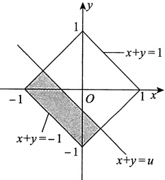
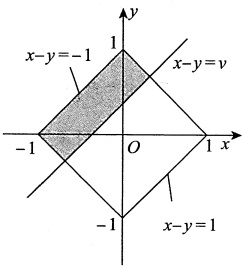

### 第5章 多维随机变量函数的分布

#### 1.

【答案】(A)

【解析】由题意得，$X_{i}\sim N(0,1)$，i=1,2，则$f_{X_{i}}(x)=\frac{1}{\sqrt{2\pi}}\mathrm{e}^{-\frac{1}{2}x^{2}}$

因为$X_{1}, X_{2}$是来自标准正态总体X的简单随机样本，所以$X_{1}, X_{2}$相互独立，故$(X_{1}, X_{2})$服从二维正态分布，即$(X_{1}, X_{2}) \sim N(0, 0; 1, 1; 0)$，其概率密度为

$$f(x_{1},x_{2})=\frac{1}{2\pi}\mathrm{e}^{-\frac{x_{1}^{2}+x_{2}^{2}}{2}},$$

利用卷积公式可得

$$\begin{aligned}f_{Y}(y)&=\int_{-\infty}^{+\infty}\left|x_{2}\right|f(x_{2}y,x_{2})\mathrm{d}(x_{2})\xrightarrow{x_{2} 记为 x}\int_{-\infty}^{+\infty}\left|x\right|f(xy,x)\mathrm{d}x\\&=2\int_{0}^{+\infty}x\cdot\frac{1}{2\pi}\mathrm{e}^{-\frac{1}{2}(y^{2}+1)x^{2}}\mathrm{d}x=\frac{1}{\pi}\int_{0}^{+\infty}\mathrm{e}^{-\frac{1}{2}(y^{2}+1)x^{2}}\mathrm{d}\left(\frac{1}{2}x^{2}\right)\\&=\frac{1}{\pi(1+y^{2})}.\end{aligned}$$

#### 2.

【答案】(D)

【解析】方法一

$$\begin{aligned}F_{Y}(y)&=P\left\{Y\leqslant y\right\}=P\left\{2X_{1}X_{2}-X_{2}\leqslant y\right\}\\&=P\left\{2X_{1}X_{2}-X_{2}\leqslant y\left|X_{1}=1\right.\right\}\bullet P\left\{X_{1}=1\right\}+\\&\quad P\left\{2X_{1}X_{2}-X_{2}\leqslant y\left|X_{1}=0\right.\right\}\bullet P\left\{X_{1}=0\right\}\\&=\frac{1}{2}P\left\{X_{2}\leqslant y\right\}+\frac{1}{2}P\left\{X_{2}\geqslant-y\right\}=P\left\{X_{2}\leqslant y\right\}=\varPhi(y).\end{aligned}$$

方法二 当$x+y\geq0$时，

$$\begin{aligned}F_{X_{2},Y}(x,y)&=P\left\{X_{2}\leq x,Y\leq y\right\}\\&=P\left\{X_{2}\leq x,2X_{1}X_{2}-X_{2}\leq y\right\}\\&=P\left\{X_{1}=1\right\}P\left\{X_{2}\leq x,2X_{1}X_{2}-X_{2}\leq y\left|X_{1}=1\right.\right\}+\\&\quad P\left\{X_{1}=0\right\}P\left\{X_{2}\leq x,2X_{1}X_{2}-X_{2}\leq y\left|X_{1}=0\right.\right\}\\&=\frac{1}{2}\left(P\left\{X_{2}\leq x,X_{2}\leq y\right\}+P\left\{X_{2}\leq x,-X_{2}\leq y\right\}\right)\\ \end{aligned}$$

$$\begin{array}{l l}{\displaystyle=\frac{1}{2}\Big[\varPhi(\operatorname*{m i n}\big\{x,y\big\})+\varPhi(x)-\varPhi(-y)\Big]}\\ {\displaystyle}\\ {\displaystyle=\frac{1}{2}\Big[\varPhi(\operatorname*{m i n}\big\{x,y\big\})+\varPhi(x)-1+\varPhi(y)\Big],}\\ \end{array}$$

$$F_{Y}(y)=\lim_{x\to+\infty}F_{X_{2},Y}(x,y)=\frac{1}{2}\left[\Phi(y)+1-1+\Phi(y)\right]=\Phi(y).$$

#### 3.

【答案】(B)

【解析】令$W = \min\{X, Y\}$，则$W \sim E(2\lambda)$.

由$Z + W = X + Y$知，$E(Z) + E(W) = E(X) + E(Y)$，于是$E(Z) = E(X) + E(Y) - E(W) = \frac{3}{2\lambda}$，而选项(A)，(C)，(D) 中的期望均不为$\frac{3}{2\lambda}$，排除，对于选项(B)，有$E\left(\frac{2X + Y}{2}\right) = \frac{3}{2\lambda}$。

事实上，随机变量Z的分布函数如下：

当z>0时，

$$\begin{aligned}F_{Z}(z)&=P\left\{Z\leq z\right\}=P\left\{\max\left\{X,Y\right\}\leq z\right\}\\&=P\left\{X\leq z,Y\leq z\right\}=P\left\{X\leq z\right\}P\left\{Y\leq z\right\}\\&=\left[F_{X}(z)\right]^{2}=(1-\mathrm{e}^{-\lambda z})^{2};\\ \end{aligned}$$

当$z\leq0$时，$F_{Z}(z)=0$

故

$$F_{Z}(z)=\left\{\begin{aligned}&(1-\mathrm{e}^{-\lambda z})^{2},&z>0,\\ &0,&z\leq0.\end{aligned}\right.$$

令$U=\frac{2X+Y}{2}$，则 U 的分布函数如下：

当$u\leq0$时，$F_{U}(u)=0$

$$\begin{align*}F_{U}(u)&=P\left\{2X+Y\leqslant2u\right\}=\iint\limits_{\substack{2x+y\leqslant2u\\ x>0,y>0}}\lambda^{2}\mathrm{e}^{-\lambda(x+y)}\mathrm{d}x\mathrm{d}y\\&=\lambda^{2}\int_{0}^{u}\left[\int_{0}^{2u-2x}\mathrm{e}^{-\lambda(x+y)}\mathrm{d}y\right]\mathrm{d}x=(1-\mathrm{e}^{-\lambda u})^{2}.\end{align*}$$

故

$$F_{U}(u)=\left\{\begin{aligned}&(1-\mathrm{e}^{-\lambda u})^{2},&u>0,\\ &0,&u\leq0.\end{aligned}\right.$$

#### 4.

【答案】(D)

【解析】方法一 显然，$F(X) \sim U(0,1)$.

令$\left\{\begin{aligned}u=&\frac{y}{x+y}\\ v=&y,\end{aligned}\right.$，则有$\left\{\begin{aligned}x=&\frac{v}{u}-v,\\ y=&v,\end{aligned}\right.$，$J=\frac{\partial(x,y)}{\partial(u,v)}=\left|\begin{matrix}-\frac{v}{u^{2}}&\frac{1}{u}-1\\ 0&1\end{matrix}\right|=-\frac{v}{u^{2}}$

由题意知，随机变量 X，Y 的联合概率密度为$f(x,y)=\left\{\begin{aligned}&\lambda^{2}e^{-\lambda(x+y)},&x>0,y>0,\\ &0,& 其他,\end{aligned}\right.$，则有

$$f_{U,V}(u,v)=f\left(\frac{v}{u}-v,v\right)\bullet\left|-\frac{v}{u^{2}}\right|=\left\{\begin{aligned}&\lambda^{2}\mathrm{e}^{-\lambda\frac{v}{u}}\bullet\frac{v}{u^{2}},&\frac{v}{u}>v>0,\\ &0,& 其他 ,\end{aligned}\right.$$

$$f_{U}(u)=\left\{\begin{aligned}&\int_{0}^{+\infty}\lambda^{2}\mathrm{e}^{-\lambda\frac{v}{u}}\frac{v}{u^{2}}\mathrm{d}v,&0<u<1,\\ &0,& 其他 \end{aligned}\right.=\left\{\begin{aligned}&1,&0<u<1,\\ &0,& 其他 .\end{aligned}\right.$$

方法二 分布函数法.

记$Z=\frac{Y}{X+Y}$，Z的分布函数为$F_{Z}(z)$，则由分布函数法可知：

当$z \leqslant 0$时，$F_{Z}(z)=0$；当$z \geqslant 1$时，$F_{Z}(z)=1$；

当0<z<1时，有

$$\begin{aligned}F_{Z}(z)&=P\left\{\frac{Y}{X+Y}\leqslant z\right\}\\&=\int_{0}^{+\infty}\mathrm{d}x\int_{0}^{\frac{xz}{1-z}}\lambda^{2}\mathrm{e}^{-\lambda(x+y)}\mathrm{d}y=\int_{0}^{+\infty}\lambda\mathrm{e}^{-\lambda x}\left(1-\mathrm{e}^{-\frac{\lambda z x}{1-z}}\right)\mathrm{d}x\\&=\int_{0}^{+\infty}\lambda\mathrm{e}^{-\lambda x}\mathrm{d}x-\int_{0}^{+\infty}\lambda\mathrm{e}^{-\frac{\lambda x}{1-z}}\mathrm{d}x=z\;.\end{aligned}$$

故

$$f_{Z}(z)=F_{Z}^{\prime}(z)=\left\{\begin{aligned}&1,&0<z<1,\\ &0,& 其他 .\end{aligned}\right.$$

【注】事实上，(A)，(B)，(C)的随机变量的取值均可能超过1，故它们均不可能服从$U(0,1)$.据此，本题即可选(D)，但这种角度很少有考生考虑到.

#### 5.

【答案】$1-\frac{1}{e}$

【解析】总体 X 的分布函数为$F(x) = P\left\{X \leq x\right\} = \int_{-\infty}^{x} f(t) dt = \left\{\begin{aligned}&1 - e^{-x},&x \geq 0,\\ &0,&x < 0,\end{aligned}\right.$，所以 Y 的分布函数为

$$\begin{aligned}F_{Y}(y)&=P\left\{Y\leqslant y\right\}=P\left\{X_{2}\leqslant y,X_{3}\leqslant y,\cdots,X_{n}\leqslant y\right\}\\&=P\left\{X_{2}\leqslant y\right\}P\left\{X_{3}\leqslant y\right\}\cdots P\left\{X_{n}\leqslant y\right\}=\left[F(y)\right]^{n-1}\\&=\left\{\begin{aligned}&(1-e^{-y})^{n-1},&y\geqslant0,\\&0,&y<0.\end{aligned}\right.\\ \end{aligned}$$

因为$P\left\{X_{1}<1\right\}=F(1)=1-\frac{1}{e}$，且$X_{1}$与Y相互独立，所以

$$\begin{aligned}P\left\{X_{1}Y-Y<0\right\}&=P\left\{X_{1}<1,Y>0\right\}+P\left\{X_{1}>1,Y<0\right\}\\&=P\left\{X_{1}<1\right\}P\left\{Y>0\right\}+P\left\{X_{1}>1\right\}P\left\{Y<0\right\}\\&=F(1)\left[1-F_{Y}(0)\right]+\left[1-F(1)\right]F_{Y}(0)\\&=1-\frac{1}{\mathrm{e}}.\\ \end{aligned}$$

#### 6.

【解析】(1)由题意得，当0<x<1时，

$$f_{Y\mid X}(y\mid x)=\left\{\begin{aligned}&\frac{1}{2x},&-x<y<x,\\ &0,& 其他 ,\end{aligned}\right.$$

则

$$f(x,y)=f_{X}(x)f_{Y\mid X}(y\mid x)=\left\{\begin{aligned}&1,&0<x<1,-x<y<x,\\ &0,& 其他 .\end{aligned}\right.$$

(2)

$$\begin{aligned}F_{W}(w)&=P\left\{W\leqslant w\right\}=P\left\{X+\left[Y\right]\leqslant w\right\}\\&=P\left\{X+\left[Y\right]\leqslant w,\left[Y\right]=-1\right\}+P\left\{X+\left[Y\right]\leqslant w,\left[Y\right]=0\right\}\\&=P\left\{X\leqslant w+1,-1<-X<Y<0\right\}+P\left\{X\leqslant w,0\leqslant Y<X<1\right\}.\\ \end{aligned}$$

若 w < -1，则$F_{W}(w) = 0$；

若$-1 \leqslant w < 0$，则$F_{W}(w)=\int_{0}^{w+1}dx\int_{-x}^{0}1dy+0=\frac{1}{2}(w+1)^{2}$;

若$0 \leq w < 1$，则$F_{W}(w) = \int_{0}^{1} dx \int_{-x}^{0} 1 dy + \int_{0}^{w} dx \int_{0}^{x} 1 dy = \frac{1}{2} + \frac{1}{2} w^{2}$;

若$w \geqslant 1$，则$F_{W}(w)=1$

故

$$F_{W}(w)=\left\{\begin{aligned}&0,&w&<-1,\\&\frac{1}{2}\left(w+1\right)^{2},&-1\leq w<0,\\&\frac{1}{2}+\frac{1}{2}w^{2},&0\leq w<1,\\&1,&w&\geq1.\end{aligned}\right.$$

#### 7.

【解析】(1)由于区域D的面积为

$$\iint_{D}\mathrm{d}\sigma=\int_{0}^{1}\mathrm{d}x\int_{x^{2}}^{\sqrt{x}}\mathrm{d}y=\int_{0}^{1}(\sqrt{x}-x^{2})\mathrm{d}x=\left(\left.\frac{2}{3}x^{\frac{3}{2}}-\frac{1}{3}x^{3}\right|_{0}^{1}\right|_{0}^{1}=\frac{1}{3},$$

故$(X,Y)$的概率密度为$f(x,y)=\left\{\begin{aligned}&3,&(x,y)\in D,\\ &0,& 其他.\end{aligned}\right.$
(2)对于$0<t<1$,$P\left\{U\leq0,X\leq t\right\}=P\left\{X>Y,X\leq t\right\}=\int_{0}^{t}\mathrm{d}x\int_{x^{2}}^{x}3\mathrm{d}y=\frac{3}{2}t^{2}-t^{3}$,

$$P\left\{U\leqslant0\right\}=P\left\{X>Y\right\}=\frac{1}{2},P\left\{X\leqslant t\right\}=\int_{0}^{t}\mathrm{d}x\int_{x^{2}}^{\sqrt{x}}3\mathrm{d}y=2t^{\frac{3}{2}}-t^{3},$$

由于$P\left\{U\leq0,X\leq t\right\}\neq P\left\{U\leq0\right\}P\left\{X\leq t\right\}$，因此U与X不相互独立.

(3)由分布函数的定义得$F_{Z}(z)=P\left\{Z\leq z\right\}=P\left\{U+X\leq z\right\}$

当z<0时，$F_{Z}(z)=0$；

$0 \leq z < 1$时，$F_{Z}(z) = P\{Z \leq z\} = P\{U + X \leq z\}$

$$\begin{aligned}F_{Z}(z)&=P\left\{Z\leqslant z\right\}=P\left\{U+X\leqslant z\right\}\\&=P\left\{U=0,X\leqslant z\right\}=P\left\{X>Y,X\leqslant z\right\}=\frac{3}{2}z^{2}-z^{3}；\end{aligned}$$

$$1\leq z<2$$

$$\begin{aligned}F_{Z}(z)&=P\left\{U+X\leqslant z\right\}=P\left\{U=0,X\leqslant z\right\}+P\left\{U=1,X\leqslant z-1\right\}\\&=P\left\{X>Y,X\leqslant z\right\}+P\left\{X\leqslant Y,X\leqslant z-1\right\}\\&=\int_{0}^{1}\mathrm{d}x\int_{x^{2}}^{x}3\mathrm{d}y+\int_{0}^{z-1}\mathrm{d}x\int_{x}^{\sqrt{x}}3\mathrm{d}y\\&=\frac{1}{2}+2(z-1)^{\frac{3}{2}}-\frac{3}{2}(z-1)^{2}；\end{aligned}$$

当$z \geqslant 2$时，$F_{Z}(z) = P\{U + X \leqslant z\} = 1$

所以

$$F_{Z}(z)=\left\{\begin{aligned}&0,&z<0,\\&\frac{3}{2}z^{2}-z^{3},&0\leq z<1,\\&\frac{1}{2}+2(z-1)^{\frac{3}{2}}-\frac{3}{2}\left(z-1\right)^{2},&1\leq z<2,\\&1,&z\geq2.\end{aligned}\right.$$

#### 8.

【解析】(1) 总体 X 的分布函数为

$$F_{X}(x)=P\left\{X\leqslant x\right\}=\int_{-\infty}^{x}f(t)\mathrm{d}t=\left\{\begin{aligned}&1-\mathrm{e}^{-x},&x\geqslant0,\\ &0,&x<0.\end{aligned}\right.$$

由分布函数的定义得

$$F_{Y}(y)=P\left\{\frac{1}{\max\limits_{1\leq i\leq n}\left\{X_{i}\right\}}\leq y\right\}.$$

当$y \leq 0$时，$F_{Y}(y)=0$；

当y>0时，

$$F_{Y}(y)=P\left\{\max_{1\leq i\leq n}\left\{X_{i}\right\}\geq\frac{1}{y}\right\}$$

$$\begin{aligned}=&1-P\left\{\max\left\{X_{1},X_{2},\cdots,X_{n}\right\}<\frac{1}{y}\right\}\\=&1-P\left\{X_{1}<\frac{1}{y}\right\}P\left\{X_{2}<\frac{1}{y}\right\}\cdots P\left\{X_{n}<\frac{1}{y}\right\}\\=&1-\left(P\left\{X<\frac{1}{y}\right\}\right)^{n},\end{aligned}$$

其中$P\left\{X<\frac{1}{y}\right\}=F_{X}\left(\frac{1}{y}\right)=1-\mathrm{e}^{-\frac{1}{y}}$，故

$$F_{Y}(y)=\left\{\begin{aligned}&1-\left(1-\mathrm{e}^{-\frac{1}{y}}\right)^{n},&y>0,\\ &0,&y\leq0.\end{aligned}\right.$$

(2) 因为$P\{X_{0}<1\}=F_{X}(1)=1-\frac{1}{\mathrm{e}}$，且$X_{0}$与 Y 相互独立，所以

$$\begin{aligned}P\left\{X_{0}Y-X_{0}-Y+1<0\right\}&=P\left\{(X_{0}-1)(Y-1)<0\right\}\\&=P\left\{X_{0}<1,Y>1\right\}+P\left\{X_{0}>1,Y<1\right\}\\&=P\left\{X_{0}<1\right\}P\left\{Y>1\right\}+P\left\{X_{0}>1\right\}P\left\{Y<1\right\}\\&=F_{X}(1)\left[1-F_{Y}(1)\right]+\left[1-F_{X}(1)\right]F_{Y}(1)\\&=\left(1-\frac{1}{\mathbf{e}}\right)(1-\mathbf{e}^{-1})^{n}+\frac{1}{\mathbf{e}}\left[1-(1-\mathbf{e}^{-1})^{n}\right]\\&=\left(1-\frac{1}{\mathbf{e}}\right)^{n}\left(1-\frac{2}{\mathbf{e}}\right)+\frac{1}{\mathbf{e}}.\\ \end{aligned}$$

#### 9.

【分析】区域D实际上是以$(-1,0)$，$(1,0)$，$(0,1)$，$(0,-1)$为顶点的正方形区域，D的面积为2，故$(X,Y)$的概率密度为$f(x,y)=\left\{\begin{aligned}&\frac{1}{2},&(x,y)\in D,\\&0,& 其他,\end{aligned}\right.$有了$f(x,y)$就可以求$f_{U}(u)$和$f_{V}(v)$.特别地，可利用$f(x,y)$的对称性.

【解析】(1) 如图(a) 所示，$U = X + Y$，$F_U(u) = P\{U \leq u\} = P\{X + Y \leq u\} = \iint\limits_{x + y \leq u} f(x, y) \, \mathrm{d}x \, \mathrm{d}y$。当$u < -1$时，$F_U(u) = 0$；

当$-1 \leq u \leq 1$时，$F_U(u) = \iint_{\{ (x,y) \mid x + y \leq u \} \cap D} \frac{1}{2} \mathrm{d}x \mathrm{d}y = \frac{u+1}{2}$；
当u>1时，$F_{U}(u)=1$

所以$f_{U}(u)=F_{U}^{\prime}(u)=\left\{\begin{aligned}&\frac{1}{2},&-1\leq u\leq1,\\&0,& 其他,\end{aligned}\right.$ $U\sim U\left[-1,1\right]$.

如图(b)所示，$V = X - Y$，$F_V(v) = P\{V \leq v\} = P\{X - Y \leq v\} = \iint\limits_{x - y \leq v} f(x, y) \, dx \, dy$。

当v<-1时，$F_{V}(v)=0$；

当$-1 \leqslant \nu \leqslant 1$时，$F_{V}(\nu) = \iint_{\left\{(x,y) \mid x - y \leqslant \nu\right\} \cap D} \frac{1}{2} dx dy = \frac{\nu + 1}{2}$；

当v>1时，$F_{V}(v)=1$

(a)

所以$f_{V}(v)=F_{V}^{\prime}(v)=\left\{\begin{aligned}&\frac{1}{2},&-1\leq v\leq1,\\&0,& 其他,\end{aligned}\right.$ $V\sim U\left[-1,1\right]$.

(2)$Cov(U,V)=E(UV)-E(U)E(V)$.显然$E(U)=E(V)=0$，而

$$\begin{aligned}E(UV)=&E\left[(X+Y)(X-Y)\right]=E(X^{2}-Y^{2})\\=&E(X^{2})-E(Y^{2}).\end{aligned}$$

(b)

由 X,Y 的对称性得$E(X^{2})=E(Y^{2})$，所以$\mathrm{Cov}(U,V)=0$，$\rho_{UV}=\frac{\mathrm{Cov}(U,V)}{\sqrt{D(U)}\sqrt{D(V)}}=0$。

#### 10.

【解析】(1)因为$X\sim B\left(2,\frac{1}{2}\right)$，所以X的概率分布为

| X | 0 | 1 | 2 |
|---|---|---|---|
| P | $\frac{1}{4}$ | $\frac{1}{2}$ | $\frac{1}{4}$ |

又$Y \sim N(0,1)$，且标准正态分布的分布函数为$\Phi(x)$

由分布函数法，得

$$\begin{aligned}F_{Z}(z)&=P\left\{Z\leq z\right\}=P\left\{(X-1)Y\leq z\right\}\\&=P\left\{(X-1)Y\leq z,X=0\right\}+P\left\{(X-1)Y\leq z,X=1\right\}+P\left\{(X-1)Y\leq z,X=2\right\}\\&=P\left\{-Y\leq z,X=0\right\}+P\left\{0\leq z,X=1\right\}+P\left\{Y\leq z,X=2\right\}\\ \end{aligned}$$

$$\begin{aligned}&=P\left\{-Y\leqslant z\right\}P\left\{X=0\right\}+P\left\{0\leqslant z\right\}P\left\{X=1\right\}+P\left\{Y\leqslant z\right\}P\left\{X=2\right\}\\&=\frac{1}{4}P\left\{Y\geqslant-z\right\}+\frac{1}{2}P\left\{0\leqslant z\right\}+\frac{1}{4}P\left\{Y\leqslant z\right\}\\&=\frac{1}{4}\varPhi(z)+\frac{1}{2}P\left\{0\leqslant z\right\}+\frac{1}{4}\varPhi(z).\end{aligned}$$

故当z<0时，$F_{Z}(z)=\frac{1}{4}\Phi(z)+\frac{1}{2}\cdot0+\frac{1}{4}\Phi(z)=\frac{1}{2}\Phi(z)$;

当$z\geq0$时，$F_{Z}(z)=\frac{1}{4}\Phi(z)+\frac{1}{2}\cdot1+\frac{1}{4}\Phi(z)=\frac{1}{2}+\frac{1}{2}\Phi(z)$.

综上，$F_{Z}(z)=\left\{\begin{aligned}&\frac{1}{2}\Phi(z),&z<0,\\&\frac{1}{2}+\frac{1}{2}\Phi(z),&z\geq0.\end{aligned}\right.$

$$\begin{aligned}(2)F(1,1)&=P\left\{Y\leq1,Z\leq1\right\}=P\left\{Y\leq1,(X-1)Y\leq1\right\}\\&=P\left\{X=0\right\}P\left\{Y\leq1,(X-1)Y\leq1\left|X=0\right.\right\}+P\left\{X=1\right\}P\left\{Y\leq1,(X-1)Y\leq1\left|X=1\right.\right\}+\\&P\left\{X=2\right\}P\left\{Y\leq1,(X-1)Y\leq1\left|X=2\right.\right\}\\&=\frac{1}{4}P\left\{Y\leq1,-Y\leq1\left|X=0\right.\right\}+\frac{1}{2}P\left\{Y\leq1,0\leq1\left|X=1\right.\right\}+\frac{1}{4}P\left\{Y\leq1,Y\leq1\left|X=2\right.\right\}\\&=\frac{1}{4}P\left\{Y\leq1,-Y\leq1\right\}+\frac{1}{2}P\left\{Y\leq1\right\}+\frac{1}{4}P\left\{Y\leq1\right\}\\&=\frac{1}{4}P\left\{-1\leq Y\leq1\right\}+\frac{3}{4}\varPhi(1)\\&=\frac{1}{4}\left[\varPhi(1)-\varPhi(-1)\right]+\frac{3}{4}\varPhi(1)\\&=\varPhi(1)-\frac{1}{4}\varPhi(-1)=\varPhi(1)-\frac{1}{4}\left[1-\varPhi(1)\right]\\&=\frac{5}{4}\varPhi(1)-\frac{1}{4}=0.801\ 6.\end{aligned}$$

#### 11.

【解析】(1)当z<0时，

$$\begin{aligned}P\left\{Z\leq z\right\}&=P\left\{X\leq z,XY>0\right\}+P\left\{-X\leq z,XY<0\right\}\\&=P\left\{X\leq z,Y<0\right\}+P\left\{X\geq-z,Y<0\right\}\\&=P\left\{X\leq z\right\}P\left\{Y<0\right\}+P\left\{X\geq-z\right\}P\left\{Y<0\right\}\\&=\frac{1}{2}\left(P\left\{X\leq z\right\}+P\left\{X\geq-z\right\}\right)\\&=\frac{1}{2}\bullet2P\left\{X\leq z\right\}=P\left\{X\leq z\right\};\\ \end{aligned}$$
当z>0时，

$$\begin{aligned}P\left\{Z>z\right\}&=P\left\{X>z,XY>0\right\}+P\left\{-X>z,XY<0\right\}\\&=P\left\{X>z,Y>0\right\}+P\left\{X<-z,Y>0\right\}\\&=P\left\{X>z\right\},\\ \end{aligned}$$

故

$$P\left\{Z>z\right\}=P\left\{X>z\right\},P\left\{Z\leq z\right\}=P\left\{X\leq z\right\}$$

因此，Z与X同分布于$N(0,1)$.

(2) 若 Z > 0，则要么 X > 0 且 Y > 0，要么 X < 0 且 Y > 0，于是 Z 与 Y 始终同号，则当 Z > 0 时，$0 < Y < +\infty$。而二维正态分布的概率密度定义域为$-\infty < y < +\infty$，$-\infty < z < +\infty$，矛盾，故 (Y,Z) 不服从二维正态分布。

【注】第(2)问的答案从定义域的角度考虑，值得学习

#### 12.

【解析】(1)记$X_{i}$为第i天的供应量，i=1,2,3，故3天总供应量$Z=Y+X_{3}$，其中$Y=X_{1}+X_{2}$，则

$$f_{Y}(x)=\int_{-\infty}^{+\infty}f(t)f(x-t)dt=\int_{0}^{x}t\mathrm{e}^{-t}(x-t)\mathrm{e}^{-x+t}\mathrm{d}t=\mathrm{e}^{-x}\int_{0}^{x}t(x-t)\mathrm{d}t=\frac{1}{6}x^{3}\mathrm{e}^{-x},x>0.$$

当$x\leq0$时，$f_{Y}(x)=0$

$$f_{Z}(x)=\int_{-\infty}^{+\infty}f_{Y}(t)f(x-t)dt=\int_{0}^{x}\frac{1}{6}t^{3}\mathrm{e}^{-t}\cdot(x-t)\mathrm{e}^{-x+t}dt=\frac{1}{6}\mathrm{e}^{-x}\int_{0}^{x}t^{3}(x-t)dt=\frac{x^{5}}{120}\mathrm{e}^{-x},x>0.$$

当$x\leq0$时，$f_{Z}(x)=0$

综上，$f_{Z}(x)=\left\{\begin{aligned}&\frac{x^{5}}{120}e^{-x},&x>0,\\ &0,&x\leq0.\end{aligned}\right.$

(2) 记$W = \max\{X_1, X_2, X_3\}$，则 W 的分布函数为

$$F_{w}(x)=P\{X_{1}\leqslant x\}P\{X_{2}\leqslant x\}P\{X_{3}\leqslant x\}=[F(x)]^{3}.$$

当x>0时，$F(x)=\int_{-\infty}^{x}f(t)dt=\int_{0}^{x}te^{-t}dt=1-(1+x)e^{-x}$;

当$x \leq 0$时，$F(x)=0$.

$$f_{w}(x)=F_{w}^{\prime}(x)=3F^{2}(x)\bullet f(x)=\left\{\begin{array}{ll}3x\mathrm{e}^{-x}(1-\mathrm{e}^{-x}-x\mathrm{e}^{-x})^{2},&x>0,\\0,&x\leqslant0.\end{array}\right.$$

【注】本题的难点在于第(1)问中计算$X_{1}+X_{2}+X_{3}$的概率密度.分解成$Y=X_{1}+X_{2},Z=Y+X_{3}$即可.
