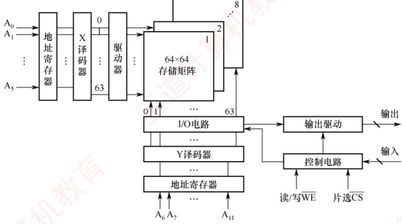
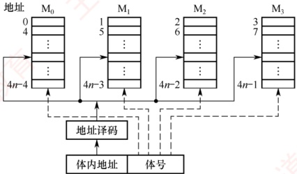

## 3.2 主存储器

### 3.2.1 半导体随机存取存储器

随机存取存储器（RAM）分为静态RAM（SRAM）和动态RAM（DRAM），二者均为易失性存储器。现代计算机中，主存主要采用DRAM，而Cache使用SRAM。

#### 1. SRAM 的工作原理

地址相同的多个存储元构成一个存储单元。若干存储单元的集合构成存储体。

SRAM 的存储元基于双稳态触发器（六晶体管 MOS）利用电路的两个稳定状态分别表示二进制 0 和 1。其静态特性体现在：读操作为非破坏性读出，因此无须再生。

SRAM 的存取速度快，但集成度低，功耗较大，成本高，通常用于高速缓冲存储器。

#### 2. DRAM 的工作原理

与 SRAM 不同，DRAM 利用栅极电容上的电荷来存储信息：有电荷表示 1，无电荷表示 0。其基本存储元仅由一个晶体管和一个电容构成，结构简单，因而集成度远高于 SRAM。

### 考点追踪 需要刷新的存储芯片：SDRAM（2015）

DRAM 具有位价低、功耗小、容量大等优势。但同时也存在明显局限：存取速度较慢；电荷会因漏电而逐渐丢失，必须定时刷新以维持数据；且读出过程为破坏性读出，需在读取后立即再生。因此，DRAM 被广泛用于大容量主存系统，在成本、容量与性能之间取得良好平衡。

#### 3. 存储芯片的组成

如图 3.5 所示，存储芯片由存储体、I/O 读/写电路、地址译码器和控制电路等部分组成。前文介绍的 DRAM 芯片的存储阵列结构，正是此图中存储矩阵的核心构成部分。

1）存储体（存储矩阵）。是存储单元的集合，通过行选择线（X）和列选择线（Y）共同选中目标单元。位于相同行列交叉点上的多个位（位平面数）被同时读/写。

2）地址译码器。用来将输入地址转换为译码输出线上的高电平信号，以驱动相应的读/写电路。地址译码方式有单译码法（一维译码）和双译码法（二维译码）两种：

单译码法。仅使用一个行译码器，同一行中所有存储单元的字线相连，构成一个字，可被同时读/写。其缺点是译码器输出线数量过多。

双译码法。如图3.5所示，地址译码器分为X（行）和Y（列）两个部分，通过行与列的交叉点唯一确定一个存储单元。这是当前DRAM芯片普遍采用的译码结构。

3）I/O电路。用于控制被选中存储单元的读/写，具有放大信号的作用。

图 3.5 存储芯片结构图

4）片选控制线。单个存储芯片容量有限，通常无法满足计算机对主存容量的需求，因此需将多个芯片组合扩展。在访问某个存储字时，必须“选中”该存储字所在的芯片，而其他芯片不被“选中”，因此需要有片选控制信号（经片选控制线传输）。

5）读/写控制线。根据 CPU 发出的读/写命令，通过读/写控制线选中单元执行相应操作。

#### 4. DRAM 芯片的关键技术

##### （1） 地址引脚复用技术

图 3.6 给出了一个 4M×4 位 DRAM 芯片的逻辑结构图。该芯片共有 11 个地址引脚（A₀～A₁₀），在行选通信信号 RAS 和列选通信信号 CAS 的控制下，分时复用传送行地址和列地址。数据端口有 4 个引脚（D₁～D₄），因此每个芯片可同时读/写 4 位数据。WE 为读/写控制信号，低电平表示操作；OE 为输出使能信号，低电平有效，高电平时断开输出驱动。芯片内部存储阵列采用三维结构，总容量为 2048×2048×4 位，即 4M×4 位。因此，行地址和列地址各需 11 位，共 4 个位平面；在任意行与列的交叉点上，4 个位平面上的数据被同时读/写。

图 3.6 一个  $4M \times 4$ 位 DRAM 芯片的逻辑结构图

### 考点追踪 DRAM 芯片地址引脚复用技术（2014）

DRAM 芯片容量较大，所需地址位数较多。为减少芯片地址引脚数量，通常采用地址引脚复用技术：行地址和列地址通过相同的引脚分两次先后输入，从而使地址引脚数量减少一半。
#### （2） 刷新机制与阵列设计优化

DRAM 芯片需要定期刷新以维持所存信息。刷新时，仅向芯片提供行地址和 RAS 信号，即可选中某一行的所有存储单元并执行读操作。由于 DRAM 采用破坏性读出，每次读取后必须立即再生：若读出为 0，则将电容充分放电；若读出为 1，则重新充电。对于图中所示的  $2048 \times 2048 \times 4$ 存储阵列，只需进行 2048 次刷新操作即可完成全芯片刷新（因刷新按整行进行，无须列地址）。芯片内部集成一个刷新计数器，可自动产生刷新所需的行地址，其位数与行地址位数相同。行地址缓冲器与刷新计数器通过一个多路选择器（MUX）共享通往行译码器的地址通路。刷新周期定义为对某一特定行完成一次刷新后，到下一次对该行再次刷新的时间间隔。

### 考点追踪 DRAM 芯片行、列设计优化原则（2018）

假定一个 DRAM 芯片的存储容量为  $2^n \times b$ 位，其存储阵列的行数为  $r$，列数为  $c$，则满足  $2^n = r \times c$。整个阵列的地址位数为  $n$，其中行地址占  $\log_2 r$ 位，列地址占  $\log_2 c$ 位，因此有  $n = \log_2 r + \log_2 c$。由于 DRAM 采用地址引脚复用技术，引脚数量由行、列地址位数中的较大者决定，为最小化地址引脚数，应使  $r$ 与  $c$ 尽可能接近。此外，DRAM 按行刷新，行数越少，刷新开销越低，故还需满足  $r \leq c$。综合考虑，通常将阵列设计为行数略小于或等于列数的近似正方形结构。

#### （3） 缓存机制与突发传输

### 考点追踪 DRAM 芯片行缓冲器容量的计算（2022）

图3.7 展示了一个 DRAM 芯片的简化示意图，其容量为  $16 \times 8$ 位，存储阵列为 4 行×4 列。

<table border=1 style='margin: auto; width: max-content;'>
  <thead><tr><th style='text-align: center;'>数据线</th><th style='text-align: center;'>位置 (行、列)</th><th style='text-align: center;'>位置 (DRAM 列)</th><th style='text-align: center;'>位置 (存储元 (2,1))</th></tr></thead>
  <tbody>
    <tr><td style='text-align: center;'>16×8位</td><td style='text-align: center;'>左端</td><td style='text-align: center;'>底部</td><td style='text-align: center;'>底部</td></tr>
    <tr><td style='text-align: center;'>0×8位</td><td style='text-align: center;'>底部</td><td style='text-align: center;'>顶部</td><td style='text-align: center;'>顶部</td></tr>
    <tr><td style='text-align: center;'>4×8位</td><td style='text-align: center;'>顶部</td><td style='text-align: center;'>底部</td><td style='text-align: center;'>底部</td></tr>
  </tbody>
</table>

图 3.7 一个 DRAM 芯片的简化示意图

由于采用地址引脚复用技术，仅需2根地址线，分时传送2位行地址和2位列地址。每个存储单元包含8位数据，因此需要8根数据线。芯片内部设有一个行缓冲器（通常由SRAM实现），用于缓存被选中行中所有列的数据。其容量等于一行中所有存储单元的数据总量，即列数×每个存储单元的位数（如4列×8位=32位）。当某一行被选中后，该行全部数据被一次性加载到行缓冲器中，后续可在每个时钟周期连续输出一个存储单元的数据（8位），从而支持突发传输，即在寻址阶段提供首地址，随后连续读取多个相邻存储单元的数据，显著

提升有效带宽。

#### 5. 同步 DRAM

目前更广泛使用的是 SDRAM（同步 DRAM）。与传统的异步 DRAM 不同，SDRAM 的数据读/写操作与系统时钟同步，能够以 CPU-主存总线的较高速率运行。在连续访问同一行（页）内的数据时，可实现突发传输，显著减少甚至避免插入等待状态。在异步 DRAM 中，CPU 发出地址和控制信号后，必须等待一段不确定的延迟时间才能获得数据或完成写入；在此期间，CPU 不断轮询存储器的状态信号，无法执行其他任务，从而降低整体执行效率。而 SDRAM 在系统时钟驱动下工作，它将 CPU 发出的地址和控制信号锁存，并在预设的若干时钟周期后返回数据或完成写入，使得 CPU 无须等待，可在延迟期间执行其他指令，显著提升系统性能。

#### 6. SRAM 和 DRAM 的比较

表3.1 详细列出了 SRAM 和 DRAM 各自的特点。

表3.1 SRAM 和 DRAM 各自的特点

<table border=1 style='margin: auto; word-wrap: break-word;'><tr><td rowspan="2">特点</td><td colspan="2">类型</td></tr><tr><td style='text-align: center; word-wrap: break-word;'>SRAM</td><td style='text-align: center; word-wrap: break-word;'>DRAM</td></tr><tr><td style='text-align: center; word-wrap: break-word;'>存储信息</td><td style='text-align: center; word-wrap: break-word;'>触发器</td><td style='text-align: center; word-wrap: break-word;'>电容</td></tr><tr><td style='text-align: center; word-wrap: break-word;'>破坏性读出</td><td style='text-align: center; word-wrap: break-word;'>非</td><td style='text-align: center; word-wrap: break-word;'>是</td></tr><tr><td style='text-align: center; word-wrap: break-word;'>需要刷新</td><td style='text-align: center; word-wrap: break-word;'>不需要</td><td style='text-align: center; word-wrap: break-word;'>需要</td></tr><tr><td style='text-align: center; word-wrap: break-word;'>送行列地址</td><td style='text-align: center; word-wrap: break-word;'>同时送</td><td style='text-align: center; word-wrap: break-word;'>分两次送（复用）</td></tr><tr><td style='text-align: center; word-wrap: break-word;'>运行速度</td><td style='text-align: center; word-wrap: break-word;'>快</td><td style='text-align: center; word-wrap: break-word;'>慢</td></tr><tr><td style='text-align: center; word-wrap: break-word;'>集成度</td><td style='text-align: center; word-wrap: break-word;'>低</td><td style='text-align: center; word-wrap: break-word;'>高</td></tr><tr><td style='text-align: center; word-wrap: break-word;'>存储成本</td><td style='text-align: center; word-wrap: break-word;'>高</td><td style='text-align: center; word-wrap: break-word;'>低</td></tr><tr><td style='text-align: center; word-wrap: break-word;'>主要用途</td><td style='text-align: center; word-wrap: break-word;'>高速缓存</td><td style='text-align: center; word-wrap: break-word;'>主机内存</td></tr></table>

### 3.2.2 非易失性存储器

#### 1. 只读存储器（ROM）的特点

### 考点追踪 RAM 和 ROM 的区别（2010）

RAM 与 ROM 均支持随机访问，但 ROM 属于非易失性存储器，具有两个显著优点：① 结构简单，位密度高于 SRAM 等可读/写存储器；② 断电后数据不丢失，可靠性高。

根据制造工艺和可编程性，ROM可分为掩模式ROM（MROM）、一次可编程ROM（PROM）和可擦除可编程ROM（EPROM）等类型；MROM由厂商固化，用户不可更改；PROM允许用户进行一次性编程；EPROM虽支持多次编程，但每次擦除需紫外线照射整片芯片，且擦写次数有限、写入速度慢，难以满足主存对高速随机读/写的需求，因此无法替代RAM。

#### 2. Flash 存储器

### 考点追踪 Flash 存储器的特点（2012）

计算机中许多固定信息需长期保存在非易失性存储器中，如系统启动所需的 BIOS（Basic Input/Output System）。早期 BIOS 固化在 MROM 或 EPROM 中，无法更新；现代主板普遍采用 Flash 存储器存储 BIOS，用户可通过厂商提供的工具直接在系统中擦除并重写。

Flash 存储器（又称闪存）是一种在 EPROM 基础上发展而来的非易失性存储器，兼具 ROM 与 RAM 的部分优点：断电后信息可长期保存；支持电擦除与在线重写，无须紫外线照射等特殊设备；其读取速度接近 RAM，但写入速度显著较慢，读/写性能不对称。

#### 3. 固态硬盘（Solid State Drive, SSD）

固态硬盘是基于 Flash 存储器构建的存储设备，由控制单元和存储单元（Flash 存储器芯片阵列）组成。它继承了 Flash 存储器的重要特性：非易失性、无机械部件、读取速度快。相比传统硬盘，SSD 具有读/写速度快、功耗低、抗震性强等优势，缺点是价格较高，且写入寿命受限于 Flash 存储器的擦写次数。

### 3.2.3 多模块存储器

多模块存储器是一种空间并行技术，通过多个结构完全相同的存储模块并行工作来提高存储器的吞吐率。由于 CPU 的速度远高于存储器，若能在一个存取周期内连续获取多条指令或多个数据字，便可更充分利用 CPU 资源，提升系统性能。多体交叉存储器正是基于这一思想设计的。

根据模块间地址分配方式的不同，多模块存储器可分为连续编址和交叉编址两种结构。

#### 1. 连续编址方式

高位地址为模块号（或体号），低位地址为模块内地址（或体内地址）。如图3.8所示，存
储器共有4个模块  $M_0 \sim M_3$，每个模块有  $n$ 个单元，各模块的地址范围如图所示。

图 3.8 连续编址的多体并行存储器

在连续编址方式下，低位的体内地址总是被送到由高位体号确定的模块内进行译码。访问一个连续主存块时，总是先在一个模块内访问，直到该模块访问完后才转到下一个模块访问。由于CPU按顺序访问存储模块，各模块不能并行访问，因此无法提高存储器的吞吐率。

**注意**

模块内的地址是连续的，存取方式仍是串行存取，因此这种存储器本质上仍属于顺序存储器。

#### 2. 交叉编址（低位交叉）方式

### 考点追踪 交叉存储器中数据的存放方式（2017）

低位地址用作模块号（体号），高位地址作为模块内地址。假设有 $m$ 个模块，每个模块含 $k$ 个存储单元，则模块编号由地址对 $m$ 取模决定，即模块号 = 单元地址 % $m$。如图 3.9 所示，单元 $0, m, \cdots, (k-1)m$ 位于模块 $\mathrm{M}_0$；单元 $1, m+1, \cdots, (k-1)m+1$ 位于模块 $\mathrm{M}_1$；以此类推。

图 3.9 交叉编址的多体并行存储器

在交叉编址方式下，由于连续地址的数据被依次分布到不同模块中，程序或数据块在物理上是“交叉存放”的，采用此方式的多模块存储器被称为交叉存储器。通过多个结构完全相同的存储模块并行工作，这种设计能够在访问连续地址时显著提高存储器的吞吐率。

交叉存储器可以采用轮流启动或同时启动两种方式。

#### （1） 轮流启动方式

若每个模块一次读/写的位数正好等于数据总线位数，模块的存取周期为 T，总线周期为 r，则为实现轮流启动方式，存储器交叉模块数应满足：

 $$m=T/r$$
### 考点追踪 交叉存储器存取时间和带宽的计算（2012、2013）

按每隔  $1/m$ 个存取周期轮流启动各模块，则每隔  $1/m$ 个存取周期就可读/写一个数据，存取速度提高 m 倍。图 3.10 展示了 4 体低位交叉轮流启动的存取时间示意图。交叉存储器要求其模块数大于或等于 m，以保证启动某模块后经过 mr 的时间后再次启动该模块时，其上次的存取操作已经完成（以保证流水线不间断）。这样，连续存取 m 个字所需的时间为

 $$t_{1}=T+(m-1)r$$

而顺序方式连续读取 m 个字所需的时间为  $t_{2}=mT$ 。可见交叉存储器的带宽大大提高。

<table border=1 style='margin: auto; width: max-content;'>
  <thead><tr><th style='text-align: center;'>时间</th><th style='text-align: center;'>序号</th><th style='text-align: center;'>类型</th></tr></thead>
  <tbody>
    <tr><td style='text-align: center;'>0</td><td style='text-align: center;'>0</td><td style='text-align: center;'>序号</td></tr>
    <tr><td style='text-align: center;'>1</td><td style='text-align: center;'>1</td><td style='text-align: center;'>序号</td></tr>
    <tr><td style='text-align: center;'>2</td><td style='text-align: center;'>2</td><td style='text-align: center;'>序号</td></tr>
    <tr><td style='text-align: center;'>3</td><td style='text-align: center;'>3</td><td style='text-align: center;'>序号</td></tr>
    <tr><td style='text-align: center;'>4</td><td style='text-align: center;'>4</td><td style='text-align: center;'>序号</td></tr>
    <tr><td style='text-align: center;'>5</td><td style='text-align: center;'>5</td><td style='text-align: center;'>序号</td></tr>
    <tr><td style='text-align: center;'>6</td><td style='text-align: center;'>6</td><td style='text-align: center;'>序号</td></tr>
    <tr><td style='text-align: center;'>7</td><td style='text-align: center;'>7</td><td style='text-align: center;'>序号</td></tr>
    <tr><td style='text-align: center;'>8</td><td style='text-align: center;'>8</td><td style='text-align: center;'>序号</td></tr>
    <tr><td style='text-align: center;'>9</td><td style='text-align: center;'>9</td><td style='text-align: center;'>序号</td></tr>
    <tr><td style='text-align: center;'>10</td><td style='text-align: center;'>10</td><td style='text-align: center;'>序号</td></tr>
    <tr><td style='text-align: center;'>11</td><td style='text-align: center;'>11</td><td style='text-align: center;'>序号</td></tr>
    <tr><td style='text-align: center;'>12</td><td style='text-align: center;'>12</td><td style='text-align: center;'>序号</td></tr>
    <tr><td style='text-align: center;'>13</td><td style='text-align: center;'>13</td><td style='text-align: center;'>序号</td></tr>
    <tr><td style='text-align: center;'>14</td><td style='text-align: center;'>14</td><td style='text-align: center;'>序号</td></tr>
    <tr><td style='text-align: center;'>15</td><td style='text-align: center;'>15</td><td style='text-align: center;'>序号</td></tr>
    <tr><td style='text-align: center;'>16</td><td style='text-align: center;'>16</td><td style='text-align: center;'>序号</td></tr>
    <tr><td style='text-align: center;'>17</td><td style='text-align: center;'>17</td><td style='text-align: center;'>序号</td></tr>
    <tr><td style='text-align: center;'>18</td><td style='text-align: center;'>18</td><td style='text-align: center;'>序号</td></tr>
    <tr><td style='text-align: center;'>19</td><td style='text-align: center;'>19</td><td style='text-align: center;'>序号</td></tr>
    <tr><td style='text-align: center;'>20</td><td style='text-align: center;'>20</td><td style='text-align: center;'>序号</td></tr>
    <tr><td style='text-align: center;'>21</td><td style='text-align: center;'>21</td><td style='text-align: center;'>序号</td></tr>
    <tr><td style='text-align: center;'>22</td><td style='text-align: center;'>22</td><td style='text-align: center;'>序号</td></tr>
    <tr><td style='text-align: center;'>23</td><td style='text-align: center;'>23</td><td style='text-align: center;'>序号</td></tr>
    <tr><td style='text-align: center;'>24</td><td style='text-align: center;'>24</td><td style='text-align: center;'>序号</td></tr>
    <tr><td style='text-align: center;'>25</td><td style='text-align: center;'>25</td><td style='text-align: center;'>序号</td></tr>
    <tr><td style='text-align: center;'>26</td><td style='text-align: center;'>26</td><td style='text-align: center;'>序号</td></tr>
    <tr><td style='text-align: center;'>27</td><td style='text-align: center;'>27</td><td style='text-align: center;'>序号</td></tr>
    <tr><td style='text-align: center;'>28</td><td style='text-align: center;'>28</td><td style='text-align: center;'>序号</td></tr>
    <tr><td style='text-align: center;'>29</td><td style='text-align: center;'>29</td><td style='text-align: center;'>序号</td></tr>
    <tr><td style='text-align: center;'>30</td><td style='text-align: center;'>30</td><td style='text-align: center;'>序号</td></tr>
    <tr><td style='text-align: center;'>31</td><td style='text-align: center;'>31</td><td style='text-align: center;'>序号</td></tr>
    <tr><td style='text-align: center;'>32</td><td style='text-align: center;'>32</td><td style='text-align: center;'>序号</td></tr>
    <tr><td style='text-align: center;'>33</td><td style='text-align: center;'>33</td><td style='text-align: center;'>序号</td></tr>
    <tr><td style='text-align: center;'>34</td><td style='text-align: center;'>34</td><td style='text-align: center;'>序号</td></tr>
    <tr><td style='text-align: center;'>35</td><td style='text-align: center;'>35</td><td style='text-align: center;'>序号</td></tr>
    <tr><td style='text-align: center;'>36</td><td style='text-align: center;'>36</td><td style='text-align: center;'>序号</td></tr>
    <tr><td style='text-align: center;'>37</td><td style='text-align: center;'>37</td><td style='text-align: center;'>序号</td></tr>
    <tr><td style='text-align: center;'>38</td><td style='text-align: center;'>38</td><td style='text-align: center;'>序号</td></tr>
    <tr><td style='text-align: center;'>39</td><td style='text-align: center;'>39</td><td style='text-align: center;'>序号</td></tr>
    <tr><td style='text-align: center;'>40</td><td style='text-align: center;'>40</td><td style='text-align: center;'>序号</td></tr>
    <tr><td style='text-align: center;'>41</td><td style='text-align: center;'>41</td><td style='text-align: center;'>序号</td></tr>
    <tr><td style='text-align: center;'>42</td><td style='text-align: center;'>42</td><td style='text-align: center;'>序号</td></tr>
    <tr><td style='text-align: center;'>43</td><td style='text-align: center;'>43</td><td style='text-align: center;'>序号</td></tr>
    <tr><td style='text-align: center;'>44</td><td style='text-align: center;'>44</td><td style='text-align: center;'>序号</td></tr>
    <tr><td style='text-align: center;'>45</td><td style='text-align: center;'>45</td><td style='text-align: center;'>序号</td></tr>
    <tr><td style='text-align: center;'>46</td><td style='text-align: center;'>46</td><td style='text-align: center;'>序号</td></tr>
    <tr><td style='text-align: center;'>47</td><td style='text-align: center;'>47</td><td style='text-align: center;'>序号</td></tr>
    <tr><td style='text-align: center;'>48</td><td style='text-align: center;'>48</td><td style='text-align: center;'>序号</td></tr>
    <tr><td style='text-align: center;'>49</td><td style='text-align: center;'>49</td><td style='text-align: center;'>序号</td></tr>
    <tr><td style='text-align: center;'>50</td><td style='text-align: center;'>50</td><td style='text-align: center;'>序号</td></tr>
    <tr><td style='text-align: center;'>51</td><td style='text-align: center;'>51</td><td style='text-align: center;'>序号</td></tr>
    <tr><td style='text-align: center;'>52</td><td style='text-align: center;'>52</td><td style='text-align: center;'>序号</td></tr>
    <tr><td style='text-align: center;'>53</td><td style='text-align: center;'>53</td><td style='text-align: center;'>序号</td></tr>
    <tr><td style='text-align: center;'>54</td><td style='text-align: center;'>54</td><td style='text-align: center;'>序号</td></tr>
    <tr><td style='text-align: center;'>55</td><td style='text-align: center;'>55</td><td style='text-align: center;'>序号</td></tr>
    <tr><td style='text-align: center;'>56</td><td style='text-align: center;'>56</td><td style='text-align: center;'>序号</td></tr>
    <tr><td style='text-align: center;'>57</td><td style='text-align: center;'>57</td><td style='text-align: center;'>序号</td></tr>
    <tr><td style='text-align: center;'>58</td><td style='text-align: center;'>58</td><td style='text-align: center;'>序号</td></tr>
    <tr><td style='text-align: center;'>59</td><td style='text-align: center;'>59</td><td style='text-align: center;'>序号</td></tr>
    <tr><td style='text-align: center;'>60</td><td style='text-align: center;'>60</td><td style='text-align: center;'>序号</td></tr>
    <tr><td style='text-align: center;'>61</td><td style='text-align: center;'>61</td><td style='text-align: center;'>序号</td></tr>
    <tr><td style='text-align: center;'>62</td><td style='text-align: center;'>62</td><td style='text-align: center;'>序号</td></tr>
    <tr><td style='text-align: center;'>63</td><td style='text-align: center;'>63</td><td style='text-align: center;'>序号</td></tr>
    <tr><td style='text-align: center;'>64</td><td style='text-align: center;'>64</td><td style='text-align: center;'>序号</td></tr>
    <tr><td style='text-align: center;'>65</td><td style='text-align: center;'>65</td><td style='text-align: center;'>序号</td></tr>
    <tr><td style='text-align: center;'>66</td><td style='text-align: center;'>66</td><td style='text-align: center;'>序号</td></tr>
    <tr><td style='text-align: center;'>67</td><td style='text-align: center;'>67</td><td style='text-align: center;'>序号</td></tr>
    <tr><td style='text-align: center;'>68</td><td style='text-align: center;'>68</td><td style='text-align: center;'>序号</td></tr>
    <tr><td style='text-align: center;'>69</td><td style='text-align: center;'>69</td><td style='text-align: center;'>序号</td></tr>
    <tr><td style='text-align: center;'>70</td><td style='text-align: center;'>70</td><td style='text-align: center;'>序号</td></tr>
    <tr><td style='text-align: center;'>71</td><td style='text-align: center;'>71</td><td style='text-align: center;'>序号</td></tr>
    <tr><td style='text-align: center;'>72</td><td style='text-align: center;'>72</td><td style='text-align: center;'>序号</td></tr>
    <tr><td style='text-align: center;'>73</td><td style='text-align: center;'>73</td><td style='text-align: center;'>序号</td></tr>
    <tr><td style='text-align: center;'>74</td><td style='text-align: center;'>74</td><td style='text-align: center;'>序号</td></tr>
    <tr><td style='text-align: center;'>75</td><td style='text-align: center;'>75</td><td style='text-align: center;'>序号</td></tr>
    <tr><td style='text-align: center;'>76</td><td style='text-align: center;'>76</td><td style='text-align: center;'>序号</td></tr>
    <tr><td style='text-align: center;'>77</td><td style='text-align: center;'>77</td><td style='text-align: center;'>序号</td></tr>
    <tr><td style='text-align: center;'>78</td><td style='text-align: center;'>78</td><td style='text-align: center;'>序号</td></tr>
    <tr><td style='text-align: center;'>79</td><td style='text-align: center;'>79</td><td style='text-align: center;'>序号</td></tr>
    <tr><td style='text-align: center;'>80</td><td style='text-align: center;'>80</td><td style='text-align: center;'>序号</td></tr>
    <tr><td style='text-align: center;'>81</td><td style='text-align: center;'>81</td><td style='text-align: center;'>序号</td></tr>
    <tr><td style='text-align: center;'>82</td><td style='text-align: center;'>82</td><td style='text-align: center;'>序号</td></tr>
    <tr><td style='text-align: center;'>83</td><td style='text-align: center;'>83</td><td style='text-align: center;'>序号</td></tr>
    <tr><td style='text-align: center;'>84</td><td style='text-align: center;'>84</td><td style='text-align: center;'>序号</td></tr>
    <tr><td style='text-align: center;'>85</td><td style='text-align: center;'>85</td><td style='text-align: center;'>序号</td></tr>
    <tr><td style='text-align: center;'>86</td><td style='text-align: center;'>86</td><td style='text-align: center;'>序号</td></tr>
    <tr><td style='text-align: center;'>87</td><td style='text-align: center;'>87</td><td style='text-align: center;'>序号</td></tr>
    <tr><td style='text-align: center;'>88</td><td style='text-align: center;'>88</td><td style='text-align: center;'>序号</td></tr>
    <tr><td style='text-align: center;'>89</td><td style='text-align: center;'>89</td><td style='text-align: center;'>序号</td></tr>
    <tr><td style='text-align: center;'>90</td><td style='text-align: center;'>90</td><td style='text-align: center;'>序号</td></tr>
    <tr><td style='text-align: center;'>91</td><td style='text-align: center;'>91</td><td style='text-align: center;'>序号</td></tr>
    <tr><td style='text-align: center;'>92</td><td style='text-align: center;'>92</td><td style='text-align: center;'>序号</td></tr>
    <tr><td style='text-align: center;'>93</td><td style='text-align: center;'>93</td><td style='text-align: center;'>序号</td></tr>
    <tr><td style='text-align: center;'>94</td><td style='text-align: center;'>94</td><td style='text-align: center;'>序号</td></tr>
    <tr><td style='text-align: center;'>95</td><td style='text-align: center;'>95</td><td style='text-align: center;'>序号</td></tr>
    <tr><td style='text-align: center;'>96</td><td style='text-align: center;'>96</td><td style='text-align: center;'>序号</td></tr>
    <tr><td style='text-align: center;'>97</td><td style='text-align: center;'>97</td><td style='text-align: center;'>序号</td></tr>
    <tr><td style='text-align: center;'>98</td><td style='text-align: center;'>98</td><td style='text-align: center;'>序号</td></tr>
    <tr><td style='text-align: center;'>99</td><td style='text-align: center;'>99</td><td style='text-align: center;'>序号</td></tr>
    <tr><td style='text-align: center;'>100</td><td style='text-align: center;'>100</td><td style='text-align: center;'>序号</td></tr>
    <tr><td style='text-align: center;'>101</td><td style='text-align: center;'>101</td><td style='text-align: center;'>序号</td></tr>
    <tr><td style='text-align: center;'>102</td><td style='text-align: center;'>102</td><td style='text-align: center;'>序号</td></tr>
    <tr><td style='text-align: center;'>103</td><td style='text-align: center;'>103</td><td style='text-align: center;'>序号</td></tr>
    <tr><td style='text-align: center;'>104</td><td style='text-align: center;'>104</td><td style='text-align: center;'>序号</td></tr>
    <tr><td style='text-align: center;'>105</td><td style='text-align: center;'>105</td><td style='text-align: center;'>序号</td></tr>
    <tr><td style='text-align: center;'>106</td><td style='text-align: center;'>106</td><td style='text-align: center;'>序号</td></tr>
    <tr><td style='text-align: center;'>107</td><td style='text-align: center;'>107</td><td style='text-align: center;'>序号</td></tr>
    <tr><td style='text-align: center;'>108</td><td style='text-align: center;'>108</td><td style='text-align: center;'>序号</td></tr>
    <tr><td style='text-align: center;'>109</td><td style='text-align: center;'>109</td><td style='text-align: center;'>序号</td></tr>
    <tr><td style='text-align: center;'>110</td><td style='text-align: center;'>110</td><td style='text-align: center;'>序号</td></tr>
    <tr><td style='text-align: center;'>111</td><td style='text-align: center;'>111</td><td style='text-align: center;'>序号</td></tr>
    <tr><td style='text-align: center;'>112</td><td style='text-align: center;'>112</td><td style='text-align: center;'>序号</td></tr>
    <tr><td style='text-align: center;'>113</td><td style='text-align: center;'>113</td><td style='text-align: center;'>序号</td></tr>
    <tr><td style='text-align: center;'>114</td><td style='text-align: center;'>114</td><td style='text-align: center;'>序号</td></tr>
    <tr><td style='text-align: center;'>115</td><td style='text-align: center;'>115</td><td style='text-align: center;'>序号</td></tr>
    <tr><td style='text-align: center;'>116</td><td style='text-align: center;'>116</td><td style='text-align: center;'>序号</td></tr>
    <tr><td style='text-align: center;'>117</td><td style='text-align: center;'>117</td><td style='text-align: center;'>序号</td></tr>
    <tr><td style='text-align: center;'>118</td><td style='text-align: center;'>118</td><td style='text-align: center;'>序号</td></tr>
    <tr><td style='text-align: center;'>119</td><td style='text-align: center;'>119</td><td style='text-align: center;'>序号</td></tr>
    <tr><td style='text-align: center;'>120</td><td style='text-align: center;'>120</td><td style='text-align: center;'>序号</td></tr>
    <tr><td style='text-align: center;'>121</td><td style='text-align: center;'>121</td><td style='text-align: center;'>序号</td></tr>
    <tr><td style='text-align: center;'>122</td><td style='text-align: center;'>122</td><td style='text-align: center;'>序号</td></tr>
    <tr><td style='text-align: center;'>123</td><td style='text-align: center;'>123</td><td style='text-align: center;'>序号</td></tr>
    <tr><td style='text-align: center;'>124</td><td style='text-align: center;'>124</td><td style='text-align: center;'>序号</td></tr>
    <tr><td style='text-align: center;'>125</td><td style='text-align: center;'>125</td><td style='text-align: center;'>序号</td></tr>
    <tr><td style='text-align: center;'>126</td><td style='text-align: center;'>126</td><td style='text-align: center;'>序号</td></tr>
    <tr><td style='text-align: center;'>127</td><td style='text-align: center;'>127</td><td style='text-align: center;'>序号</td></tr>
    <tr><td style='text-align: center;'>128</td><td style='text-align: center;'>128</td><td style='text-align: center;'>序号</td></tr>
    <tr><td style='text-align: center;'>129</td><td style='text-align: center;'>129</td><td style='text-align: center;'>序号</td></tr>
    <tr><td style='text-align: center;'>130</td><td style='text-align: center;'>130</td><td style='text-align: center;'>序号</td></tr>
    <tr><td style='text-align: center;'>131</td><td style='text-align: center;'>131</td><td style='text-align: center;'>序号</td></tr>
    <tr><td style='text-align: center;'>132</td><td style='text-align: center;'>132</td><td style='text-align: center;'>序号</td></tr>
    <tr><td style='text-align: center;'>133</td><td style='text-align: center;'>133</td><td style='text-align: center;'>序号</td></tr>
    <tr><td style='text-align: center;'>134</td><td style='text-align: center;'>134</td><td style='text-align: center;'>序号</td></tr>
    <tr><td style='text-align: center;'>135</td><td style='text-align: center;'>135</td><td style='text-align: center;'>序号</td></tr>
    <tr><td style='text-align: center;'>136</td><td style='text-align: center;'>136</td><td style='text-align: center;'>序号</td></tr>
    <tr><td style='text-align: center;'>137</td><td style='text-align: center;'>137</td><td style='text-align: center;'>序号</td></tr>
    <tr><td style='text-align: center;'>138</td><td style='text-align: center;'>138</td><td style='text-align: center;'>序号</td></tr>
    <tr><td style='text-align: center;'>139</td><td style='text-align: center;'>139</td><td style='text-align: center;'>序号</td></tr>
    <tr><td style='text-align: center;'>140</td><td style='text-align: center;'>140</td><td style='text-align: center;'>序号</td></tr>
    <tr><td style='text-align: center;'>141</td><td style='text-align: center;'>141</td><td style='text-align: center;'>序号</td></tr>
    <tr><td style='text-align: center;'>142</td><td style='text-align: center;'>142</td><td style='text-align: center;'>序号</td></tr>
    <tr><td style='text-align: center;'>143</td><td style='text-align: center;'>143</td><td style='text-align: center;'>序号</td></tr>
    <tr><td style='text-align: center;'>144</td><td style='text-align: center;'>144</td><td style='text-align: center;'>序号</td></tr>
    <tr><td style='text-align: center;'>145</td><td style='text-align: center;'>145</td><td style='text-align: center;'>序号</td></tr>
    <tr><td style='text-align: center;'>146</td><td style='text-align: center;'>146</td><td style='text-align: center;'>序号</td></tr>
    <tr><td style='text-align: center;'>147</td><td style='text-align: center;'>147</td><td style='text-align: center;'>序号</td></tr>
    <tr><td style='text-align: center;'>148</td><td style='text-align: center;'>148</td><td style='text-align: center;'>序号</td></tr>
    <tr><td style='text-align: center;'>149</td><td style='text-align: center;'>149</td><td style='text-align: center;'>序号</td></tr>
    <tr><td style='text-align: center;'>150</td><td style='text-align: center;'>150</td><td style='text-align: center;'>序号</td></tr>
    <tr><td style='text-align: center;'>151</td><td style='text-align: center;'>151</td><td style='text-align: center;'>序号</td></tr>
    <tr><td style='text-align: center;'>152</td><td style='text-align: center;'>152</td><td style='text-align: center;'>序号</td></tr>
    <tr><td style='text-align: center;'>153</td><td style='text-align: center;'>153</td><td style='text-align: center;'>序号</td></tr>
    <tr><td style='text-align: center;'>154</td><td style='text-align: center;'>154</td><td style='text-align: center;'>序号</td></tr>
    <tr><td style='text-align: center;'>155</td><td style='text-align: center;'>155</td><td style='text-align: center;'>序号</td></tr>
    <tr><td style='text-align: center;'>156</td><td style='text-align: center;'>156</td><td style='text-align: center;'>序号</td></tr>
    <tr><td style='text-align: center;'>157</td><td style='text-align: center;'>157</td><td style='text-align: center;'>序号</td></tr>
    <tr><td style='text-align: center;'>158</td><td style='text-align: center;'>158</td><td style='text-align: center;'>序号</td></tr>
    <tr><td style='text-align: center;'>159</td><td style='text-align: center;'>159</td><td style='text-align: center;'>序号</td></tr>
    <tr><td style='text-align: center;'>160</td><td style='text-align: center;'>160</td><td style='text-align: center;'>序号</td></tr>
    <tr><td style='text-align: center;'>161</td><td style='text-align: center;'>161</td><td style='text-align: center;'>序号</td></tr>
    <tr><td style='text-align: center;'>162</td><td style='text-align: center;'>162</td><td style='text-align: center;'>序号</td></tr>
    <tr><td style='text-align: center;'>163</td><td style='text-align: center;'>163</td><td style='text-align: center;'>序号</td></tr>
    <tr><td style='text-align: center;'>164</td><td style='text-align: center;'>164</td><td style='text-align: center;'>序号</td></tr>
    <tr><td style='text-align: center;'>165</td><td style='text-align: center;'>165</td><td style='text-align: center;'>序号</td></tr>
    <tr><td style='text-align: center;'>166</td><td style='text-align: center;'>166</td><td style='text-align: center;'>序号</td></tr>
    <tr><td style='text-align: center;'>167</td><td style='text-align: center;'>167</td><td style='text-align: center;'>序号</td></tr>
    <tr><td style='text-align: center;'>168</td><td style='text-align: center;'>168</td><td style='text-align: center;'>序号</td></tr>
    <tr><td style='text-align: center;'>169</td><td style='text-align: center;'>169</td><td style='text-align: center;'>序号</td></tr>
    <tr><td style='text-align: center;'>170</td><td style='text-align: center;'>170</td><td style='text-align: center;'>序号</td></tr>
    <tr><td style='text-align: center;'>171</td><td style='text-align: center;'>171</td><td style='text-align: center;'>序号</td></tr>
    <tr><td style='text-align: center;'>172</td><td style='text-align: center;'>172</td><td style='text-align: center;'>序号</td></tr>
    <tr><td style='text-align: center;'>173</td><td style='text-align: center;'>173</td><td style='text-align: center;'>序号</td></tr>
    <tr><td style='text-align: center;'>174</td><td style='text-align: center;'>174</td><td style='text-align: center;'>序号</td></tr>
    <tr><td style='text-align: center;'>175</td><td style='text-align: center;'>175</td><td style='text-align: center;'>序号</td></tr>
    <tr><td style='text-align: center;'>176</td><td style='text-align: center;'>176</td><td style='text-align: center;'>序号</td></tr>
    <tr><td style='text-align: center;'>177</td><td style='text-align: center;'>177</td><td style='text-align: center;'>序号</td></tr>
    <tr><td style='text-align: center;'>178</td><td style='text-align: center;'>178</td><td style='text-align: center;'>序号</td></tr>
    <tr><td style='text-align: center;'>179</td><td style='text-align: center;'>179</td><td style='text-align: center;'>序号</td></tr>
    <tr><td style='text-align: center;'>180</td><td style='text-align: center;'>180</td><td style='text-align: center;'>序号</td></tr>
    <tr><td style='text-align: center;'>181</td><td style='text-align: center;'>181</td><td style='text-align: center;'>序号</td></tr>
    <tr><td style='text-align: center;'>182</td><td style='text-align: center;'>182</td><td style='text-align: center;'>序号</td></tr>
    <tr><td style='text-align: center;'>183</td><td style='text-align: center;'>183</td><td style='text-align: center;'>序号</td></tr>
    <tr><td style='text-align: center;'>184</td><td style='text-align: center;'>184</td><td style='text-align: center;'>序号</td></tr>
    <tr><td style='text-align: center;'>185</td><td style='text-align: center;'>185</td><td style='text-align: center;'>序号</td></tr>
    <tr><td style='text-align: center;'>186</td><td style='text-align: center;'>186</td><td style='text-align: center;'>序号</td></tr>
    <tr><td style='text-align: center;'>187</td><td style='text-align: center;'>187</td><td style='text-align: center;'>序号</td></tr>
    <tr><td style='text-align: center;'>188</td><td style='text-align: center;'>188</td><td style='text-align: center;'>序号</td></tr>
    <tr><td style='text-align: center;'>189</td><td style='text-align: center;'>189</td><td style='text-align: center;'>序号</td></tr>
    <tr><td style='text-align: center;'>190</td><td style='text-align: center;'>190</td><td style='text-align: center;'>序号</td></tr>
    <tr><td style='text-align: center;'>191</td><td style='text-align: center;'>191</td><td style='text-align: center;'>序号</td></tr>
    <tr><td style='text-align: center;'>192</td><td style='text-align: center;'>192</td><td style='text-align: center;'>序号</td></tr>
    <tr><td style='text-align: center;'>193</td><td style='text-align: center;'>193</td><td style='text-align: center;'>序号</td></tr>
    <tr><td style='text-align: center;'>194</td><td style='text-align: center;'>194</td><td style='text-align: center;'>序号</td></tr>
    <tr><td style='text-align: center;'>195</td><td style='text-align: center;'>195</td><td style='text-align: center;'>序号</td></tr>
    <tr><td style='text-align: center;'>196</td><td style='text-align: center;'>196</td><td style='text-align: center;'>序号</td></tr>
    <tr><td style='text-align: center;'>197</td><td style='text-align: center;'>197</td><td style='text-align: center;'>序号</td></tr>
    <tr><td style='text-align: center;'>198</td><td style='text-align: center;'>198</td><td style='text-align: center;'>序号</td></tr>
    <tr><td style='text-align: center;'>199</td><td style='text-align: center;'>199</td><td style='text-align: center;'>序号</td></tr>
    <tr><td style='text-align: center;'>200</td><td style='text-align: center;'>200</td><td style='text-align: center;'>序号</td></tr>
    <tr><td style='text-align: center;'>201</td><td style='text-align: center;'>201</td><td style='text-align: center;'>序号</td></tr>
    <tr><td style='text-align: center;'>202</td><td style='text-align: center;'>202</td><td style='text-align: center;'>序号</td></tr>
    <tr><td style='text-align: center;'>203</td><td style='text-align: center;'>203</td><td style='text-align: center;'>序号</td></tr>
    <tr><td style='text-align: center;'>204</td><td style='text-align: center;'>204</td><td style='text-align: center;'>序号</td></tr>
    <tr><td style='text-align: center;'>205</td><td style='text-align: center;'>205</td><td style='text-align: center;'>序号</td></tr>
    <tr><td style='text-align: center;'>206</td><td style='text-align: center;'>206</td><td style='text-align: center;'>序号</td></tr>
    <tr><td style='text-align: center;'>207</td><td style='text-align: center;'>207</td><td style='text-align: center;'>序号</td></tr>
    <tr><td style='text-align: center;'>208</td><td style='text-align: center;'>208</td><td style='text-align: center;'>序号</td></tr>
    <tr><td style='text-align: center;'>209</td><td style='text-align: center;'>209</td><td style='text-align: center;'>序号</td></tr>
    <tr><td style='text-align: center;'>210</td><td style='text-align: center;'>210</td><td style='text-align: center;'>序号</td></tr>
    <tr><td style='text-align: center;'>211</td><td style='text-align: center;'>211</td><td style='text-align: center;'>序号</td></tr>
    <tr><td style='text-align: center;'>212</td><td style='text-align: center;'>212</td><td style='text-align: center;'>序号</td></tr>
    <tr><td style='text-align: center;'>213</td><td style='text-align: center;'>213</td><td style='text-align: center;'>序号</td></tr>
    <tr><td style='text-align: center;'>214</td><td style='text-align: center;'>214</td><td style='text-align: center;'>序号</td></tr>
    <tr><td style='text-align: center;'>215</td><td style='text-align: center;'>215</td><td style='text-align: center;'>序号</td></tr>
    <tr><td style='text-align: center;'>216</td><td style='text-align: center;'>216</td><td style='text-align: center;'>序号</td></tr>
    <tr><td style='text-align: center;'>217</td><td style='text-align: center;'>217</td><td style='text-align: center;'>序号</td></tr>
    <tr><td style='text-align: center;'>218</td><td style='text-align: center;'>218</td><td style='text-align: center;'>序号</td></tr>
    <tr><td style='text-align: center;'>219</td><td style='text-align: center;'>219</td><td style='text-align: center;'>序号</td></tr>
    <tr><td style='text-align: center;'>220</td><td style='text-align: center;'>220</td><td style='text-align: center;'>序号</td></tr>
    <tr><td style='text-align: center;'>221</td><td style='text-align: center;'>221</td><td style='text-align: center;'>序号</td></tr>
    <tr><td style='text-align: center;'>222</td><td style='text-align: center;'>222</td><td style='text-align: center;'>序号</td></tr>
    <tr><td style='text-align: center;'>223</td><td style='text-align: center;'>223</td><td style='text-align: center;'>序号</td></tr>
    <tr><td style='text-align: center;'>224</td><td style='text-align: center;'>224</td><td style='text-align: center;'>序号</td></tr>
    <tr><td style='text-align: center;'>225</td><td style='text-align: center;'>225</td><td style='text-align: center;'>序号</td></tr>
    <tr><td style='text-align: center;'>226</td><td style='text-align: center;'>226</td><td style='text-align: center;'>序号</td></tr>
    <tr><td style='text-align: center;'>227</td><td style='text-align: center;'>227</td><td style='text-align: center;'>序号</td></tr>
    <tr><td style='text-align: center;'>228</td><td style='text-align: center;'>228</td><td style='text-align: center;'>序号</td></tr>
    <tr><td style='text-align: center;'>229</td><td style='text-align: center;'>229</td><td style='text-align: center;'>序号</td></tr>
    <tr><td style='text-align: center;'>230</td><td style='text-align: center;'>230</td><td style='text-align: center;'>序号</td></tr>
    <tr><td style='text-align: center;'>231</td><td style='text-align: center;'>231</td><td style='text-align: center;'>序号</td></tr>
    <tr><td style='text-align: center;'>232</td><td style='text-align: center;'>232</td><td style='text-align: center;'>序号</td></tr>
    <tr><td style='text-align: center;'>233</td><td style='text-align: center;'>233</td><td style='text-align: center;'>序号</td></tr>
    <tr><td style='text-align: center;'>234</td><td style='text-align: center;'>234</td><td style='text-align: center;'>序号</td></tr>
    <tr><td style='text-align: center;'>235</td><td style='text-align: center;'>235</td><td style='text-align: center;'>序号</td></tr>
    <tr><td style='text-align: center;'>236</td><td style='text-align: center;'>236</td><td style='text-align: center;'>序号</td></tr>
    <tr><td style='text-align: center;'>237</td><td style='text-align: center;'>237</td><td style='text-align: center;'>序号</td></tr>
    <tr><td style='text-align: center;'>238</td><td style='text-align: center;'>238</td><td style='text-align: center;'>序号</td></tr>
    <tr><td style='text-align: center;'>239</td><td style='text-align: center;'>239</td><td style='text-align: center;'>序号</td></tr>
    <tr><td style='text-align: center;'>240</td><td style='text-align: center;'>240</td><td style='text-align: center;'>序号</td></tr>
    <tr><td style='text-align: center;'>241</td><td style='text-align: center;'>241</td><td style='text-align: center;'>序号</td></tr>
    <tr><td style='text-align: center;'>242</td><td style='text-align: center;'>242</td><td style='text-align: center;'>序号</td></tr>
    <tr><td style='text-align: center;'>243</td><td style='text-align: center;'>243</td><td style='text-align: center;'>序号</td></tr>
    <tr><td style='text-align: center;'>244</td><td style='text-align: center;'>244</td><td style='text-align: center;'>序号</td></tr>
    <tr><td style='text-align: center;'>245</td><td style='text-align: center;'>245</td><td style='text-align: center;'>序号</td></tr>
    <tr><td style='text-align: center;'>246</td><td style='text-align: center;'>246</td><td style='text-align: center;'>序号</td></tr>
    <tr><td style='text-align: center;'>247</td><td style='text-align: center;'>247</td><td style='text-align: center;'>序号</td></tr>
    <tr><td style='text-align: center;'>248</td><td style='text-align: center;'>248</td><td style='text-align: center;'>序号</td></tr>
    <tr><td style='text-align: center;'>249</td><td style='text-align: center;'>249</td><td style='text-align: center;'>序号</td></tr>
    <tr><td style='text-align: center;'>250</td><td style='text-align: center;'>250</td><td style='text-align: center;'>序号</td></tr>
    <tr><td style='text-align: center;'>251</td><td style='text-align: center;'>251</td><td style='text-align: center;'>序号</td></tr>
    <tr><td style='text-align: center;'>252</td><td style='text-align: center;'>252</td><td style='text-align: center;'>序号</td></tr>
    <tr><td style='text-align: center;'>253</td><td style='text-align: center;'>253</td><td style='text-align: center;'>序号</td></tr>
    <tr><td style='text-align: center;'>254</td><td style='text-align: center;'>254</td><td style='text-align: center;'>序号</td></tr>
    <tr><td style='text-align: center;'>255</td><td style='text-align: center;'>255</td><td style='text-align: center;'>序号</td></tr>
    <tr><td style='text-align: center;'>256</td><td style='text-align: center;'>256</td><td style='text-align: center;'>序号</td></tr>
    <tr><td style='text-align: center;'>257</td><td style='text-align: center;'>257</td><td style='text-align: center;'>序号</td></tr>
    <tr><td style='text-align: center;'>258</td><td style='text-align: center;'>258</td><td style='text-align: center;'>序号</td></tr>
    <tr><td style='text-align: center;'>259</td><td style='text-align: center;'>259</td><td style='text-align: center;'>序号</td></tr>
    <tr><td style='text-align: center;'>260</td><td style='text-align: center;'>260</td><td style='text-align: center;'>序号</td></tr>
    <tr><td style='text-align: center;'>261</td><td style='text-align: center;'>261</td><td style='text-align: center;'>序号</td></tr>
    <tr><td style='text-align: center;'>262</td><td style='text-align: center;'>262</td><td style='text-align: center;'>序号</td></tr>
    <tr><td style='text-align: center;'>263</td><td style='text-align: center;'>263</td><td style='text-align: center;'>序号</td></tr>
    <tr><td style='text-align: center;'>264</td><td style='text-align: center;'>264</td><td style='text-align: center;'>序号</td></tr>
    <tr><td style='text-align: center;'>265</td><td style='text-align: center;'>265</td><td style='text-align: center;'>序号</td></tr>
    <tr><td style='text-align: center;'>266</td><td style='text-align: center;'>266</td><td style='text-align: center;'>序号</td></tr>
    <tr><td style='text-align: center;'>267</td><td style='text-align: center;'>267</td><td style='text-align: center;'>序号</td></tr>
    <tr><td style='text-align: center;'>268</td><td style='text-align: center;'>268</td><td style='text-align: center;'>序号</td></tr>
    <tr><td style='text-align: center;'>269</td><td style='text-align: center;'>269</td><td style='text-align: center;'>序号</td></tr>
    <tr><td style='text-align: center;'>270</td><td style='text-align: center;'>270</td><td style='text-align: center;'>序号</td></tr>
    <tr><td style='text-align: center;'>271</td><td style='text-align: center;'>271</td><td style='text-align: center;'>序号</td></tr>
    <tr><td style='text-align: center;'>272</td><td style='text-align: center;'>272</td><td style='text-align: center;'>序号</td></tr>
    <tr><td style='text-align: center;'>273</td><td style='text-align: center;'>273</td><td style='text-align: center;'>序号</td></tr>
    <tr><td style='text-align: center;'>274</td><td style='text-align: center;'>274</td><td style='text-align: center;'>序号</td></tr>
    <tr><td style='text-align: center;'>275</td><td style='text-align: center;'>275</td><td style='text-align: center;'>序号</td></tr>
    <tr><td style='text-align: center;'>276</td><td style='text-align: center;'>276</td><td style='text-align: center;'>序号</td></tr>
    <tr><td style='text-align: center;'>277</td><td style='text-align: center;'>277</td><td style='text-align: center;'>序号</td></tr>
    <tr><td style='text-align: center;'>278</td><td style='text-align: center;'>278</td><td style='text-align: center;'>序号</td></tr>
    <tr><td style='text-align: center;'>279</td><td style='text-align: center;'>279</td><td style='text-align: center;'>序号</td></tr>
    <tr><td style='text-align: center;'>280</td><td style='text-align: center;'>280</td><td style='text-align: center;'>序号</td></tr>
    <tr><td style='text-align: center;'>281</td><td style='text-align: center;'>281</td><td style='text-align: center;'>序号</td></tr>
    <tr><td style='text-align: center;'>282</td><td style='text-align: center;'>282</td><td style='text-align: center;'>序号</td></tr>
    <tr><td style='text-align: center;'>283</td><td style='text-align: center;'>283</td><td style='text-align: center;'>序号</td></tr>
    <tr><td style='text-align: center;'>284</td><td style='text-align: center;'>284</td><td style='text-align: center;'>序号</td></tr>
    <tr><td style='text-align: center;'>285</td><td style='text-align: center;'>285</td><td style='text-align: center;'>序号</td></tr>
    <tr><td style='text-align: center;'>286</td><td style='text-align: center;'>286</td><td style='text-align: center;'>序号</td></tr>
    <tr><td style='text-align: center;'>287</td><td style='text-align: center;'>287</td><td style='text-align: center;'>序号</td></tr>
    <tr><td style='text-align: center;'>288</td><td style='text-align: center;'>288</td><td style='text-align: center;'>序号</td></tr>
    <tr><td style='text-align: center;'>289</td><td style='text-align: center;'>289</td><td style='text-align: center;'>序号</td></tr>
    <tr><td style='text-align: center;'>290</td><td style='text-align: center;'>290</td><td style='text-align: center;'>序号</td></tr>
    <tr><td style='text-align: center;'>291</td><td style='text-align: center;'>291</td><td style='text-align: center;'>序号</td></tr>
    <tr><td style='text-align: center;'>292</td><td style='text-align: center;'>292</td><td style='text-align: center;'>序号</td></tr>
    <tr><td style='text-align: center;'>293</td><td style='text-align: center;'>293</td><td style='text-align: center;'>序号</td></tr>
    <tr><td style='text-align: center;'>294</td><td style='text-align: center;'>294</td><td style='text-align: center;'>序号</td></tr>
    <tr><td style='text-align: center;'>295</td><td style='text-align: center;'>295</td><td style='text-align: center;'>序号</td></tr>
    <tr><td style='text-align: center;'>296</td><td style='text-align: center;'>296</td><td style='text-align: center;'>序号</td></tr>
    <tr><td style='text-align: center;'>297</td><td style='text-align: center;'>297</td><td style='text-align: center;'>序号</td></tr>
    <tr><td style='text-align: center;'>298</td><td style='text-align: center;'>298</td><td style='text-align: center;'>序号</td></tr>
    <tr><td style='text-align: center;'>299</td><td style='text-align: center;'>299</td><td style='text-align: center;'>序号</td></tr>
    <tr><td style='text-align: center;'>300</td><td style='text-align: center;'>300</td><td style='text-align: center;'>序号</td></tr>
    <tr><td style='text-align: center;'>301</td><td style='text-align: center;'>301</td><td style='text-align: center;'>序号</td></tr>
    <tr><td style='text-align: center;'>302</td><td style='text-align: center;'>302</td><td style='text-align: center;'>序号</td></tr>
    <tr><td style='text-align: center;'>303</td><td style='text-align: center;'>303</td><td style='text-align: center;'>序号</td></tr>
    <tr><td style='text-align: center;'>304</td><td style='text-align: center;'>304</td><td style='text-align: center;'>序号</td></tr>
    <tr><td style='text-align: center;'>305</td><td style='text-align: center;'>305</td><td style='text-align: center;'>序号</td></tr>
    <tr><td style='text-align: center;'>306</td><td style='text-align: center;'>306</td><td style='text-align: center;'>序号</td></tr>
    <tr><td style='text-align: center;'>307</td><td style='text-align: center;'>307</td><td style='text-align: center;'>序号</td></tr>
    <tr><td style='text-align: center;'>308</td><td style='text-align: center;'>308</td><td style='text-align: center;'>序号</td></tr>
    <tr><td style='text-align: center;'>309</td><td style='text-align: center;'>309</td><td style='text-align: center;'>序号</td></tr>
    <tr><td style='text-align: center;'>310</td><td style='text-align: center;'>310</td><td style='text-align: center;'>序号</td></tr>
    <tr><td style='text-align: center;'>311</td><td style='text-align: center;'>311</td><td style='text-align: center;'>序号</td></tr>
    <tr><td style='text-align: center;'>312</td><td style='text-align: center;'>312</td><td style='text-align: center;'>序号</td></tr>
    <tr><td style='text-align: center;'>313</td><td style='text-align: center;'>313</td><td style='text-align: center;'>序号</td></tr>
    <tr><td style='text-align: center;'>314</td><td style='text-align: center;'>314</td><td style='text-align: center;'>序号</td></tr>
    <tr><td style='text-align: center;'>315</td><td style='text-align: center;'>315</td><td style='text-align: center;'>序号</td></tr>
    <tr><td style='text-align: center;'>316</td><td style='text-align: center;'>316</td><td style='text-align: center;'>序号</td></tr>
    <tr><td style='text-align: center;'>317</td><td style='text-align: center;'>317</td><td style='text-align: center;'>序号</td></tr>
    <tr><td style='text-align: center;'>318</td><td style='text-align: center;'>318</td><td style='text-align: center;'>序号</td></tr>
    <tr><td style='text-align: center;'>319</td><td style='text-align: center;'>319</td><td style='text-align: center;'>序号</td></tr>
    <tr><td style='text-align: center;'>320</td><td style='text-align: center;'>320</td><td style='text-align: center;'>序号</td></tr>
    <tr><td style='text-align: center;'>321</td><td style='text-align: center;'>321</td><td style='text-align: center;'>序号</td></tr>
    <tr><td style='text-align: center;'>322</td><td style='text-align: center;'>322</td><td style='text-align: center;'>序号</td></tr>
    <tr><td style='text-align: center;'>323</td><td style='text-align: center;'>323</td><td style='text-align: center;'>序号</td></tr>
    <tr><td style='text-align: center;'>324</td><td style='text-align: center;'>324</td><td style='text-align: center;'>序号</td></tr>
    <tr><td style='text-align: center;'>325</td><td style='text-align: center;'>325</td><td style='text-align: center;'>序号</td></tr>
    <tr><td style='text-align: center;'>326</td><td style='text-align: center;'>326</td><td style='text-align: center;'>序号</td></tr>
    <tr><td style='text-align: center;'>327</td><td style='text-align: center;'>327</td><td style='text-align: center;'>序号</td></tr>
    <tr><td style='text-align: center;'>328</td><td style='text-align: center;'>328</td><td style='text-align: center;'>序号</td></tr>
    <tr><td style='text-align: center;'>329</td><td style='text-align: center;'>329</td><td style='text-align: center;'>序号</td></tr>
    <tr><td style='text-align: center;'>330</td><td style='text-align: center;'>330</td><td style='text-align: center;'>序号</td></tr>
    <tr><td style='text-align: center;'>331</td><td style='text-align: center;'>331</td><td style='text-align: center;'>序号</td></tr>
    <tr><td style='text-align: center;'>332</td><td style='text-align: center;'>332</td><td style='text-align: center;'>序号</td></tr>
    <tr><td style='text-align: center;'>333</td><td style='text-align: center;'>333</td><td style='text-align: center;'>序号</td></tr>
    <tr><td style='text-align: center;'>334</td><td style='text-align: center;'>334</td><td style='text-align: center;'>序号</td></tr>
    <tr><td style='text-align: center;'>335</td><td style='text-align: center;'>335</td><td style='text-align: center;'>序号</td></tr>
    <tr><td style='text-align: center;'>336</td><td style='text-align: center;'>336</td><td style='text-align: center;'>序号</td></tr>
    <tr><td style='text-align: center;'>337</td><td style='text-align: center;'>337</td><td style='text-align: center;'>序号</td></tr>
    <tr><td style='text-align: center;'>338</td><td style='text-align: center;'>338</td><td style='text-align: center;'>序号</td></tr>
    <tr><td style='text-align: center;'>339</td><td style='text-align: center;'>339</td><td style='text-align: center;'>序号</td></tr>
    <tr><td style='text-align: center;'>340</td><td style='text-align: center;'>340</td><td style='text-align: center;'>序号</td></tr>
    <tr><td style='text-align: center;'>341</td><td style='text-align: center;'>341</td><td style='text-align: center;'>序号</td></tr>
    <tr><td style='text-align: center;'>342</td><td style='text-align: center;'>342</td><td style='text-align: center;'>序号</td></tr>
    <tr><td style='text-align: center;'>343</td><td style='text-align: center;'>343</td><td style='text-align: center;'>序号</td></tr>
    <tr><td style='text-align: center;'>344</td><td style='text-align: center;'>344</td><td style='text-align: center;'>序号</td></tr>
    <tr><td style='text-align: center;'>345</td><td style='text-align: center;'>345</td><td style='text-align: center;'>序号</td></tr>
    <tr><td style='text-align: center;'>346</td><td style='text-align: center;'>346</td><td style='text-align: center;'>序号</td></tr>
    <tr><td style='text-align: center;'>347</td><td style='text-align: center;'>347</td><td style='text-align: center;'>序号</td></tr>
    <tr><td style='text-align: center;'>348</td><td style='text-align: center;'>348</td><td style='text-align: center;'>序号</td></tr>
    <tr><td style='text-align: center;'>349</td><td style='text-align: center;'>349</td><td style='text-align: center;'>序号</td></tr>
    <tr><td style='text-align: center;'>350</td><td style='text-align: center;'>350</td><td style='text-align: center;'>序号</td></tr>
    <tr><td style='text-align: center;'>351</td><td style='text-align: center;'>351</td><td style='text-align: center;'>序号</td></tr>
    <tr><td style='text-align: center;'>352</td><td style='text-align: center;'>352</td><td style='text-align: center;'>序号</td></tr>
    <tr><td style='text-align: center;'>353</td><td style='text-align: center;'>353</td><td style='text-align: center;'>序号</td></tr>
    <tr><td style='text-align: center;'>354</td><td style='text-align: center;'>354</td><td style='text-align: center;'>序号</td></tr>
    <tr><td style='text-align: center;'>355</td><td style='text-align: center;'>355</td><td style='text-align: center;'>序号</td></tr>
    <tr><td style='text-align: center;'>356</td><td style='text-align: center;'>356</td><td style='text-align: center;'>序号</td></tr>
    <tr><td style='text-align: center;'>357</td><td style='text-align: center;'>357</td><td style='text-align: center;'>序号</td></tr>
    <tr><td style='text-align: center;'>358</td><td style='text-align: center;'>358</td><td style='text-align: center;'>序号</td></tr>
    <tr><td style='text-align: center;'>359</td><td style='text-align: center;'>359</td><td style='text-align: center;'>序号</td></tr>
    <tr><td style='text-align: center;'>360</td><td style='text-align: center;'>360</td><td style='text-align: center;'>序号</td></tr>
    <tr><td style='text-align: center;'>361</td><td style='text-align: center;'>361</td><td style='text-align: center;'>序号</td></tr>
    <tr><td style='text-align: center;'>362</td><td style='text-align: center;'>362</td><td style='text-align: center;'>序号</td></tr>
    <tr><td style='text-align: center;'>363</td><td style='text-align: center;'>363</td><td style='text-align: center;'>序号</td></tr>
    <tr><td style='text-align: center;'>364</td><td style='text-align: center;'>364</td><td style='text-align: center;'>序号</td></tr>
    <tr><td style='text-align: center;'>365</td><td style='text-align: center;'>365</td><td style='text-align: center;'>序号</td></tr>
    <tr><td style='text-align: center;'>366</td><td style='text-align: center;'>366</td><td style='text-align: center;'>序号</td></tr>
    <tr><td style='text-align: center;'>367</td><td style='text-align: center;'>367</td><td style='text-align: center;'>序号</td></tr>
    <tr><td style='text-align: center;'>368</td><td style='text-align: center;'>368</td><td style='text-align: center;'>序号</td></tr>
    <tr><td style='text-align: center;'>369</td><td style='text-align: center;'>369</td><td style='text-align: center;'>序号</td></tr>
    <tr><td style='text-align: center;'>370</td><td style='text-align: center;'>370</td><td style='text-align: center;'>序号</td></tr>
    <tr><td style='text-align: center;'>371</td><td style='text-align: center;'>371</td><td style='text-align: center;'>序号</td></tr>
    <tr><td style='text-align: center;'>372</td><td style='text-align: center;'>372</td><td style='text-align: center;'>序号</td></tr>
    <tr><td style='text-align: center;'>373</td><td style='text-align: center;'>373</td><td style='text-align: center;'>序号</td></tr>
    <tr><td style='text-align: center;'>374</td><td style='text-align: center;'>374</td><td style='text-align: center;'>序号</td></tr>
    <tr><td style='text-align: center;'>375</td><td style='text-align: center;'>375</td><td style='text-align: center;'>序号</td></tr>
    <tr><td style='text-align: center;'>376</td><td style='text-align: center;'>376</td><td style='text-align: center;'>序号</td></tr>
    <tr><td style='text-align: center;'>377</td><td style='text-align: center;'>377</td><td style='text-align: center;'>序号</td></tr>
    <tr><td style='text-align: center;'>378</td><td style='text-align: center;'>378</td><td style='text-align: center;'>序号</td></tr>
    <tr><td style='text-align: center;'>379</td><td style='text-align: center;'>379</td><td style='text-align: center;'>序号</td></tr>
    <tr><td style='text-align: center;'>380</td><td style='text-align: center;'>380</td><td style='text-align: center;'>序号</td></tr>
    <tr><td style='text-align: center;'>381</td><td style='text-align: center;'>381</td><td style='text-align: center;'>序号</td></tr>
    <tr><td style='text-align: center;'>382</td><td style='text-align: center;'>382</td><td style='text-align: center;'>序号</td></tr>
    <tr><td style='text-align: center;'>383</td><td style='text-align: center;'>383</td><td style='text-align: center;'>序号</td></tr>
    <tr><td style='text-align: center;'>384</td><td style='text-align: center;'>384</td><td style='text-align: center;'>序号</td></tr>
    <tr><td style='text-align: center;'>385</td><td style='text-align: center;'>385</td><td style='text-align: center;'>序号</td></tr>
    <tr><td style='text-align: center;'>386</td><td style='text-align: center;'>386</td><td style='text-align: center;'>序号</td></tr>
    <tr><td style='text-align: center;'>387</td><td style='text-align: center;'>387</td><td style='text-align: center;'>序号</td></tr>
    <tr><td style='text-align: center;'>388</td><td style='text-align: center;'>388</td><td style='text-align: center;'>序号</td></tr>
    <tr><td style='text-align: center;'>389</td><td style='text-align: center;'>389</td><td style='text-align: center;'>序号</td></tr>
    <tr><td style='text-align: center;'>390</td><td style='text-align: center;'>390</td><td style='text-align: center;'>序号</td></tr>
    <tr><td style='text-align: center;'>391</td><td style='text-align: center;'>391</td><td style='text-align: center;'>序号</td></tr>
    <tr><td style='text-align: center;'>392</td><td style='text-align: center;'>392</td><td style='text-align: center;'>序号</td></tr>
    <tr><td style='text-align: center;'>393</td><td style='text-align: center;'>393</td><td style='text-align: center;'>序号</td></tr>
    <tr><td style='text-align: center;'>394</td><td style='text-align: center;'>394</td><td style='text-align: center;'>序号</td></tr>
    <tr><td style='text-align: center;'>395</td><td style='text-align: center;'>395</td><td style='text-align: center;'>序号</td></tr>
    <tr><td style='text-align: center;'>396</td><td style='text-align: center;'>396</td><td style='text-align: center;'>序号</td></tr>
    <tr><td style='text-align: center;'>397</td><td style='text-align: center;'>397</td><td style='text-align: center;'>序号</td></tr>
    <tr><td style='text-align: center;'>398</td><td style='text-align: center;'>398</td><td style='text-align: center;'>序号</td></tr>
    <tr><td style='text-align: center;'>399</td><td style='text-align: center;'>399</td><td style='text-align: center;'>序号</td></tr>
    <tr><td style='text-align: center;'>400</td><td style='text-align: center;'>400</td><td style='text-align: center;'>时间</td></tr>
    <tr><td style='text-align: center;'>401</td><td style='text-align: center;'>401</td><td style='text-align: center;'>时间</td></tr>
    <tr><td style='text-align: center;'>402</td><td style='text-align: center;'>402</td><td style='text-align: center;'>时间</td></tr>
    <tr><td style='text-align: center;'>403</td><td style='text-align: center;'>403</td><td style='text-align: center;'>时间</td></tr>
    <tr><td style='text-align: center;'>404</td><td style='text-align: center;'>404</td><td style='text-align: center;'>时间</td></tr>
    <tr><td style='text-align: center;'>405</td><td style='text-align: center;'>405</td><td style='text-align: center;'>时间</td></tr>
    <tr><td style='text-align: center;'>406</td><td style='text-align: center;'>406</td><td style='text-align: center;'>时间</td></tr>
    <tr><td style='text-align: center;'>407</td><td style='text-align: center;'>407</td><td style='text-align: center;'>时间</td></tr>
    <tr><td style='text-align: center;'>408</td><td style='text-align: center;'>408</td><td style='text-align: center;'>时间</td></tr>
    <tr><td style='text-align: center;'>409</td><td style='text-align: center;'>409</td><td style='text-align: center;'>时间</td></tr>
    <tr><td style='text-align: center;'>410</td><td style='text-align: center;'>410</td><td style='text-align: center;'>时间</td></tr>
    <tr><td style='text-align: center;'>411</td><td style='text-align: center;'>411</td><td style='text-align: center;'>时间</td></tr>
    <tr><td style='text-align: center;'>412</td><td style='text-align: center;'>412</td><td style='text-align: center;'>时间</td></tr>
    <tr><td style='text-align: center;'>413</td><td style='text-align: center;'>413</td><td style='text-align: center;'>时间</td></tr>
    <tr><td style='text-align: center;'>414</td><td style='text-align: center;'>414</td><td style='text-align: center;'>时间</td></tr>
    <tr><td style='text-align: center;'>415</td><td style='text-align: center;'>415</td><td style='text-align: center;'>时间</td></tr>
    <tr><td style='text-align: center;'>416</td><td style='text-align: center;'>416</td><td style='text-align: center;'>时间</td></tr>
    <tr><td style='text-align: center;'>417</td><td style='text-align: center;'>417</td><td style='text-align: center;'>时间</td></tr>
    <tr><td style='text-align: center;'>418</td><td style='text-align: center;'>418</td><td style='text-align: center;'>时间</td></tr>
    <tr><td style='text-align: center;'>419</td><td style='text-align: center;'>419</td><td style='text-align: center;'>时间</td></tr>
    <tr><td style='text-align: center;'>420</td><td style='text-align: center;'>420</td><td style='text-align: center;'>时间</td></tr>
    <tr><td style='text-align: center;'>421</td><td style='text-align: center;'>421</td><td style='text-align: center;'>时间</td></tr>
    <tr><td style='text-align: center;'>422</td><td style='text-align: center;'>422</td><td style='text-align: center;'>时间</td></tr>
    <tr><td style='text-align: center;'>423</td><td style='text-align: center;'>423</td><td style='text-align: center;'>时间</td></tr>
    <tr><td style='text-align: center;'>424</td><td style='text-align: center;'>424</td><td style='text-align: center;'>时间</td></tr>
    <tr><td style='text-align: center;'>425</td><td style='text-align: center;'>425</td><td style='text-align: center;'>时间</td></tr>
    <tr><td style='text-align: center;'>426</td><td style='text-align: center;'>426</td><td style='text-align: center;'>时间</td></tr>
    <tr><td style='text-align: center;'>427</td><td style='text-align: center;'>427</td><td style='text-align: center;'>时间</td></tr>
    <tr><td style='text-align: center;'>428</td><td style='text-align: center;'>428</td><td style='text-align: center;'>时间</td></tr>
    <tr><td style='text-align: center;'>429</td><td style='text-align: center;'>429</td><td style='text-align: center;'>时间</td></tr>
    <tr><td style='text-align: center;'>430</td><td style='text-align: center;'>430</td><td style='text-align: center;'>时间</td></tr>
    <tr><td style='text-align: center;'>431</td><td style='text-align: center;'>431</td><td style='text-align: center;'>时间</td></tr>
    <tr><td style='text-align: center;'>432</td><td style='text-align: center;'>432</td><td style='text-align: center;'>时间</td></tr>
    <tr><td style='text-align: center;'>433</td><td style='text-align: center;'>433</td><td style='text-align: center;'>时间</td></tr>
    <tr><td style='text-align: center;'>434</td><td style='text-align: center;'>434</td><td style='text-align: center;'>时间</td></tr>
    <tr><td style='text-align: center;'>435</td><td style='text-align: center;'>435</td><td style='text-align: center;'>时间</td></tr>
    <tr><td style='text-align: center;'>436</td><td style='text-align: center;'>436</td><td style='text-align: center;'>时间</td></tr>
    <tr><td style='text-align: center;'>437</td><td style='text-align: center;'>437</td><td style='text-align: center;'>时间</td></tr>
    <tr><td style='text-align: center;'>438</td><td style='text-align: center;'>438</td><td style='text-align: center;'>时间</td></tr>
    <tr><td style='text-align: center;'>439</td><td style='text-align: center;'>439</td><td style='text-align: center;'>时间</td></tr>
    <tr><td style='text-align: center;'>440</td><td style='text-align: center;'>440</td><td style='text-align: center;'>时间</td></tr>
    <tr><td style='text-align: center;'>441</td><td style='text-align: center;'>441</td><td style='text-align: center;'>时间</td></tr>
    <tr><td style='text-align: center;'>442</td><td style='text-align: center;'>442</td><td style='text-align: center;'>时间</td></tr>
    <tr><td style='text-align: center;'>443</td><td style='text-align: center;'>443</td><td style='text-align: center;'>时间</td></tr>
    <tr><td style='text-align: center;'>444</td><td style='text-align: center;'>444</td><td style='text-align: center;'>时间</td></tr>
    <tr><td style='text-align: center;'>445</td><td style='text-align: center;'>445</td><td style='text-align: center;'>时间</td></tr>
    <tr><td style='text-align: center;'>446</td><td style='text-align: center;'>446</td><td style='text-align: center;'>时间</td></tr>
    <tr><td style='text-align: center;'>447</td><td style='text-align: center;'>447</td><td style='text-align: center;'>时间</td></tr>
    <tr><td style='text-align: center;'>448</td><td style='text-align: center;'>448</td><td style='text-align: center;'>时间</td></tr>
    <tr><td style='text-align: center;'>449</td><td style='text-align: center;'>449</td><td style='text-align: center;'>时间</td></tr>
    <tr><td style='text-align: center;'>450</td><td style='text-align: center;'>450</td><td style='text-align: center;'>时间</td></tr>
    <tr><td style='text-align: center;'>451</td><td style='text-align: center;'>451</td><td style='text-align: center;'>时间</td></tr>
    <tr><td style='text-align: center;'>452</td><td style='text-align: center;'>452</td><td style='text-align: center;'>时间</td></tr>
    <tr><td style='text-align: center;'>453</td><td style='text-align: center;'>453</td><td style='text-align: center;'>时间</td></tr>
    <tr><td style='text-align: center;'>454</td><td style='text-align: center;'>454</td><td style='text-align: center;'>时间</td></tr>
    <tr><td style='text-align: center;'>455</td><td style='text-align: center;'>455</td><td style='text-align: center;'>时间</td></tr>
    <tr><td style='text-align: center;'>456</td><td style='text-align: center;'>456</td><td style='text-align: center;'>时间</td></tr>
    <tr><td style='text-align: center;'>457</td><td style='text-align: center;'>457</td><td style='text-align: center;'>时间</td></tr>
    <tr><td style='text-align: center;'>458</td><td style='text-align: center;'>458</td><td style='text-align: center;'>时间</td></tr>
    <tr><td style='text-align: center;'>459</td><td style='text-align: center;'>459</td><td style='text-align: center;'>时间</td></tr>
    <tr><td style='text-align: center;'>460</td><td style='text-align: center;'>460</td><td style='text-align: center;'>时间</td></tr>
    <tr><td style='text-align: center;'>461</td><td style='text-align: center;'>461</td><td style='text-align: center;'>时间</td></tr>
    <tr><td style='text-align: center;'>462</td><td style='text-align: center;'>462</td><td style='text-align: center;'>时间</td></tr>
    <tr><td style='text-align: center;'>463</td><td style='text-align: center;'>463</td><td style='text-align: center;'>时间</td></tr>
    <tr><td style='text-align: center;'>464</td><td style='text-align: center;'>464</td><td style='text-align: center;'>时间</td></tr>
    <tr><td style='text-align: center;'>465</td><td style='text-align: center;'>465</td><td style='text-align: center;'>时间</td></tr>
    <tr><td style='text-align: center;'>466</td><td style='text-align: center;'>466</td><td style='text-align: center;'>时间</td></tr>
    <tr><td style='text-align: center;'>467</td><td style='text-align: center;'>467</td><td style='text-align: center;'>时间</td></tr>
    <tr><td style='text-align: center;'>468</td><td style='text-align: center;'>468</td><td style='text-align: center;'>时间</td></tr>
    <tr><td style='text-align: center;'>469</td><td style='text-align: center;'>469</td><td style='text-align: center;'>时间</td></tr>
    <tr><td style='text-align: center;'>470</td><td style='text-align: center;'>470</td><td style='text-align: center;'>时间</td></tr>
    <tr><td style='text-align: center;'>471</td><td style='text-align: center;'>471</td><td style='text-align: center;'>时间</td></tr>
    <tr><td style='text-align: center;'>472</td><td style='text-align: center;'>472</td><td style='text-align: center;'>时间</td></tr>
    <tr><td style='text-align: center;'>473</td><td style='text-align: center;'>473</td><td style='text-align: center;'>时间</td></tr>
    <tr><td style='text-align: center;'>474</td><td style='text-align: center;'>474</td><td style='text-align: center;'>时间</td></tr>
    <tr><td style='text-align: center;'>475</td><td style='text-align: center;'>475</td><td style='text-align: center;'>时间</td></tr>
    <tr><td style='text-align: center;'>476</td><td style='text-align: center;'>476</td><td style='text-align: center;'>时间</td></tr>
    <tr><td style='text-align: center;'>477</td><td style='text-align: center;'>477</td><td style='text-align: center;'>时间</td></tr>
    <tr><td style='text-align: center;'>478</td><td style='text-align: center;'>478</td><td style='text-align: center;'>时间</td></tr>
    <tr><td style='text-align: center;'>479</td><td style='text-align: center;'>479</td><td style='text-align: center;'>时间</td></tr>
    <tr><td style='text-align: center;'>480</td><td style='text-align: center;'>480</td><td style='text-align: center;'>时间</td></tr>
    <tr><td style='text-align: center;'>481</td><td style='text-align: center;'>481</td><td style='text-align: center;'>时间</td></tr>
    <tr><td style='text-align: center;'>482</td><td style='text-align: center;'>482</td><td style='text-align: center;'>时间</td></tr>
    <tr><td style='text-align: center;'>483</td><td style='text-align: center;'>483</td><td style='text-align: center;'>时间</td></tr>
    <tr><td style='text-align: center;'>484</td><td style='text-align: center;'>484</td><td style='text-align: center;'>时间</td></tr>
    <tr><td style='text-align: center;'>485</td><td style='text-align: center;'>485</td><td style='text-align: center;'>时间</td></tr>
    <tr><td style='text-align: center;'>486</td><td style='text-align: center;'>486</td><td style='text-align: center;'>时间</td></tr>
    <tr><td style='text-align: center;'>487</td><td style='text-align: center;'>487</td><td style='text-align: center;'>时间</td></tr>
    <tr><td style='text-align: center;'>488</td><td style='text-align: center;'>488</td><td style='text-align: center;'>时间</td></tr>
    <tr><td style='text-align: center;'>489</td><td style='text-align: center;'>489</td><td style='text-align: center;'>时间</td></tr>
    <tr><td style='text-align: center;'>490</td><td style='text-align: center;'>490</td><td style='text-align: center;'>时间</td></tr>
    <tr><td style='text-align: center;'>491</td><td style='text-align: center;'>491</td><td style='text-align: center;'>时间</td></tr>
    <tr><td style='text-align: center;'>492</td><td style='text-align: center;'>492</td><td style='text-align: center;'>时间</td></tr>
    <tr><td style='text-align: center;'>493</td><td style='text-align: center;'>493</td><td style='text-align: center;'>时间</td></tr>
    <tr><td style='text-align: center;'>494</td><td style='text-align: center;'>494</td><td style='text-align: center;'>时间</td></tr>
    <tr><td style='text-align: center;'>495</td><td style='text-align: center;'>495</td><td style='text-align: center;'>时间</td></tr>
    <tr><td style='text-align: center;'>496</td><td style='text-align: center;'>496</td><td style='text-align: center;'>时间</td></tr>
    <tr><td style='text-align: center;'>497</td><td style='text-align: center;'>497</td><td style='text-align: center;'>时间</td></tr>
    <tr><td style='text-align: center;'>498</td><td style='text-align: center;'>498</td><td style='text-align: center;'>时间</td></tr>
    <tr><td style='text-align: center;'>499</td><td style='text-align: center;'>499</td><td style='text-align: center;'>时间</td></tr>
    <tr><td style='text-align: center;'>500</td><td style='text-align: center;'>500</td><td style='text-align: center;'>时间</td></tr>
    <tr><td style='text-align: center;'>501</td><td style='text-align: center;'>501</td><td style='text-align: center;'>时间</td></tr>
    <tr><td style='text-align: center;'>502</td><td style='text-align: center;'>502</td><td style='text-align: center;'>时间</td></tr>
    <tr><td style='text-align: center;'>503</td><td style='text-align: center;'>503</td><td style='text-align: center;'>时间</td></tr>
    <tr><td style='text-align: center;'>504</td><td style='text-align: center;'>504</td><td style='text-align: center;'>时间</td></tr>
    <tr><td style='text-align: center;'>505</td><td style='text-align: center;'>505</td><td style='text-align: center;'>时间</td></tr>
    <tr><td style='text-align: center;'>506</td><td style='text-align: center;'>506</td><td style='text-align: center;'>时间</td></tr>
    <tr><td style='text-align: center;'>507</td><td style='text-align: center;'>507</td><td style='text-align: center;'>时间</td></tr>
    <tr><td style='text-align: center;'>508</td><td style='text-align: center;'>508</td><td style='text-align: center;'>时间</td></tr>
    <tr><td style='text-align: center;'>509</td><td style='text-align: center;'>509</td><td style='text-align: center;'>时间</td></tr>
    <tr><td style='text-align: center;'>510</td><td style='text-align: center;'>510</td><td style='text-align: center;'>时间</td></tr>
    <tr><td style='text-align: center;'>511</td><td style='text-align: center;'>511</td><td style='text-align: center;'>时间</td></tr>
    <tr><td style='text-align: center;'>512</td><td style='text-align: center;'>512</td><td style='text-align: center;'>时间</td></tr>
    <tr><td style='text-align: center;'>513</td><td style='text-align: center;'>513</td><td style='text-align: center;'>时间</td></tr>
    <tr><td style='text-align: center;'>514</td><td style='text-align: center;'>514</td><td style='text-align: center;'>时间</td></tr>
    <tr><td style='text-align: center;'>515</td><td style='text-align: center;'>515</td><td style='text-align: center;'>时间</td></tr>
    <tr><td style='text-align: center;'>516</td><td style='text-align: center;'>516</td><td style='text-align: center;'>时间</td></tr>
    <tr><td style='text-align: center;'>517</td><td style='text-align: center;'>517</td><td style='text-align: center;'>时间</td></tr>
    <tr><td style='text-align: center;'>518</td><td style='text-align: center;'>518</td><td style='text-align: center;'>时间</td></tr>
    <tr><td style='text-align: center;'>519</td><td style='text-align: center;'>519</td><td style='text-align: center;'>时间</td></tr>
    <tr><td style='text-align: center;'>520</td><td style='text-align: center;'>520</td><td style='text-align: center;'>时间</td></tr>
    <tr><td style='text-align: center;'>521</td><td style='text-align: center;'>521</td><td style='text-align: center;'>时间</td></tr>
    <tr><td style='text-align: center;'>522</td><td style='text-align: center;'>522</td><td style='text-align: center;'>时间</td></tr>
    <tr><td style='text-align: center;'>523</td><td style='text-align: center;'>523</td><td style='text-align: center;'>时间</td></tr>
    <tr><td style='text-align: center;'>524</td><td style='text-align: center;'>524</td><td style='text-align: center;'>时间</td></tr>
    <tr><td style='text-align: center;'>525</td><td style='text-align: center;'>525</td><td style='text-align: center;'>时间</td></tr>
    <tr><td style='text-align: center;'>526</td><td style='text-align: center;'>526</td><td style='text-align: center;'>时间</td></tr>
    <tr><td style='text-align: center;'>527</td><td style='text-align: center;'>527</td><td style='text-align: center;'>时间</td></tr>
    <tr><td style='text-align: center;'>528</td><td style='text-align: center;'>528</td><td style='text-align: center;'>时间</td></tr>
    <tr><td style='text-align: center;'>529</td><td style='text-align: center;'>529</td><td style='text-align: center;'>时间</td></tr>
    <tr><td style='text-align: center;'>530</td><td style='text-align: center;'>530</td><td style='text-align: center;'>时间</td></tr>
    <tr><td style='text-align: center;'>531</td><td style='text-align: center;'>531</td><td style='text-align: center;'>时间</td></tr>
    <tr><td style='text-align: center;'>532</td><td style='text-align: center;'>532</td><td style='text-align: center;'>时间</td></tr>
    <tr><td style='text-align: center;'>533</td><td style='text-align: center;'>533</td><td style='text-align: center;'>时间</td></tr>
    <tr><td style='text-align: center;'>534</td><td style='text-align: center;'>534</td><td style='text-align: center;'>时间</td></tr>
    <tr><td style='text-align: center;'>535</td><td style='text-align: center;'>535</td><td style='text-align: center;'>时间</td></tr>
    <tr><td style='text-align: center;'>536</td><td style='text-align: center;'>536</td><td style='text-align: center;'>时间</td></tr>
    <tr><td style='text-align: center;'>537</td><td style='text-align: center;'>537</td><td style='text-align: center;'>时间</td></tr>
    <tr><td style='text-align: center;'>538</td><td style='text-align: center;'>538</td><td style='text-align: center;'>时间</td></tr>
    <tr><td style='text-align: center;'>539</td><td style='text-align: center;'>539</td><td style='text-align: center;'>时间</td></tr>
    <tr><td style='text-align: center;'>540</td><td style='text-align: center;'>540</td><td style='text-align: center;'>时间</td></tr>
    <tr><td style='text-align: center;'>541</td><td style='text-align: center;'>541</td><td style='text-align: center;'>时间</td></tr>
    <tr><td style='text-align: center;'>542</td><td style='text-align: center;'>542</td><td style='text-align: center;'>时间</td></tr>
    <tr><td style='text-align: center;'>543</td><td style='text-align: center;'>543</td><td style='text-align: center;'>时间</td></tr>
    <tr><td style='text-align: center;'>544</td><td style='text-align: center;'>544</td><td style='text-align: center;'>时间</td></tr>
    <tr><td style='text-align: center;'>545</td><td style='text-align: center;'>545</td><td style='text-align: center;'>时间</td></tr>
    <tr><td style='text-align: center;'>546</td><td style='text-align: center;'>546</td><td style='text-align: center;'>时间</td></tr>
    <tr><td style='text-align: center;'>547</td><td style='text-align: center;'>547</td><td style='text-align: center;'>时间</td></tr>
    <tr><td style='text-align: center;'>548</td><td style='text-align: center;'>548</td><td style='text-align: center;'>时间</td></tr>
    <tr><td style='text-align: center;'>549</td><td style='text-align: center;'>549</td><td style='text-align: center;'>时间</td></tr>
    <tr><td style='text-align: center;'>550</td><td style='text-align: center;'>550</td><td style='text-align: center;'>时间</td></tr>
    <tr><td style='text-align: center;'>551</td><td style='text-align: center;'>551</td><td style='text-align: center;'>时间</td></tr>
    <tr><td style='text-align: center;'>552</td><td style='text-align: center;'>552</td><td style='text-align: center;'>时间</td></tr>
    <tr><td style='text-align: center;'>553</td><td style='text-align: center;'>553</td><td style='text-align: center;'>时间</td></tr>
    <tr><td style='text-align: center;'>554</td><td style='text-align: center;'>554</td><td style='text-align: center;'>时间</td></tr>
    <tr><td style='text-align: center;'>555</td><td style='text-align: center;'>555</td><td style='text-align: center;'>时间</td></tr>
    <tr><td style='text-align: center;'>556</td><td style='text-align: center;'>556</td><td style='text-align: center;'>时间</td></tr>
    <tr><td style='text-align: center;'>557</td><td style='text-align: center;'>557</td><td style='text-align: center;'>时间</td></tr>
    <tr><td style='text-align: center;'>558</td><td style='text-align: center;'>558</td><td style='text-align: center;'>时间</td></tr>
    <tr><td style='text-align: center;'>559</td><td style='text-align: center;'>559</td><td style='text-align: center;'>时间</td></tr>
    <tr><td style='text-align: center;'>560</td><td style='text-align: center;'>560</td><td style='text-align: center;'>时间</td></tr>
    <tr><td style='text-align: center;'>561</td><td style='text-align: center;'>561</td><td style='text-align: center;'>时间</td></tr>
    <tr><td style='text-align: center;'>562</td><td style='text-align: center;'>562</td><td style='text-align: center;'>时间</td></tr>
    <tr><td style='text-align: center;'>563</td><td style='text-align: center;'>563</td><td style='text-align: center;'>时间</td></tr>
    <tr><td style='text-align: center;'>564</td><td style='text-align: center;'>564</td><td style='text-align: center;'>时间</td></tr>
    <tr><td style='text-align: center;'>565</td><td style='text-align: center;'>565</td><td style='text-align: center;'>时间</td></tr>
    <tr><td style='text-align: center;'>566</td><td style='text-align: center;'>566</td><td style='text-align: center;'>时间</td></tr>
    <tr><td style='text-align: center;'>567</td><td style='text-align: center;'>567</td><td style='text-align: center;'>时间</td></tr>
    <tr><td style='text-align: center;'>568</td><td style='text-align: center;'>568</td><td style='text-align: center;'>时间</td></tr>
    <tr><td style='text-align: center;'>569</td><td style='text-align: center;'>569</td><td style='text-align: center;'>时间</td></tr>
    <tr><td style='text-align: center;'>570</td><td style='text-align: center;'>570</td><td style='text-align: center;'>时间</td></tr>
    <tr><td style='text-align: center;'>571</td><td style='text-align: center;'>571</td><td style='text-align: center;'>时间</td></tr>
    <tr><td style='text-align: center;'>572</td><td style='text-align: center;'>572</td><td style='text-align: center;'>时间</td></tr>
    <tr><td style='text-align: center;'>573</td><td style='text-align: center;'>573</td><td style='text-align: center;'>时间</td></tr>
    <tr><td style='text-align: center;'>574</td><td style='text-align: center;'>574</td><td style='text-align: center;'>时间</td></tr>
    <tr><td style='text-align: center;'>575</td><td style='text-align: center;'>575</td><td style='text-align: center;'>时间</td></tr>
    <tr><td style='text-align: center;'>576</td><td style='text-align: center;'>576</td><td style='text-align: center;'>时间</td></tr>
    <tr><td style='text-align: center;'>577</td><td style='text-align: center;'>577</td><td style='text-align: center;'>时间</td></tr>
    <tr><td style='text-align: center;'>578</td><td style='text-align: center;'>578</td><td style='text-align: center;'>时间</td></tr>
    <tr><td style='text-align: center;'>579</td><td style='text-align: center;'>579</td><td style='text-align: center;'>时间</td></tr>
    <tr><td style='text-align: center;'>580</td><td style='text-align: center;'>580</td><td style='text-align: center;'>时间</td></tr>
    <tr><td style='text-align: center;'>581</td><td style='text-align: center;'>581</td><td style='text-align: center;'>时间</td></tr>
    <tr><td style='text-align: center;'>582</td><td style='text-align: center;'>582</td><td style='text-align: center;'>时间</td></tr>
    <tr><td style='text-align: center;'>583</td><td style='text-align: center;'>583</td><td style='text-align: center;'>时间</td></tr>
    <tr><td style='text-align: center;'>584</td><td style='text-align: center;'>584</td><td style='text-align: center;'>时间</td></tr>
    <tr><td style='text-align: center;'>585</td><td style='text-align: center;'>585</td><td style='text-align: center;'>时间</td></tr>
    <tr><td style='text-align: center;'>586</td><td style='text-align: center;'>586</td><td style='text-align: center;'>时间</td></tr>
    <tr><td style='text-align: center;'>587</td><td style='text-align: center;'>587</td><td style='text-align: center;'>时间</td></tr>
    <tr><td style='text-align: center;'>588</td><td style='text-align: center;'>588</td><td style='text-align: center;'>时间</td></tr>
    <tr><td style='text-align: center;'>589</td><td style='text-align: center;'>589</td><td style='text-align: center;'>时间</td></tr>
    <tr><td style='text-align: center;'>590</td><td style='text-align: center;'>590</td><td style='text-align: center;'>时间</td></tr>
    <tr><td style='text-align: center;'>591</td><td style='text-align: center;'>591</td><td style='text-align: center;'>时间</td></tr>
    <tr><td style='text-align: center;'>592</td><td style='text-align: center;'>592</td><td style='text-align: center;'>时间</td></tr>
    <tr><td style='text-align: center;'>593</td><td style='text-align: center;'>593</td><td style='text-align: center;'>时间</td></tr>
    <tr><td style='text-align: center;'>594</td><td style='text-align: center;'>594</td><td style='text-align: center;'>时间</td></tr>
    <tr><td style='text-align: center;'>595</td><td style='text-align: center;'>595</td><td style='text-align: center;'>时间</td></tr>
    <tr><td style='text-align: center;'>596</td><td style='text-align: center;'>596</td><td style='text-align: center;'>时间</td></tr>
    <tr><td style='text-align: center;'>597</td><td style='text-align: center;'>597</td><td style='text-align: center;'>时间</td></tr>
    <tr><td style='text-align: center;'>598</td><td style='text-align: center;'>598</td><td style='text-align: center;'>时间</td></tr>
    <tr><td style='text-align: center;'>599</td><td style='text-align: center;'>599</td><td style='text-align: center;'>时间</td></tr>
    <tr><td style='text-align: center;'>600</td><td style='text-align: center;'>600</td><td style='text-align: center;'>时间</td></tr>
    <tr><td style='text-align: center;'>601</td><td style='text-align: center;'>601</td><td style='text-align: center;'>时间</td></tr>
    <tr><td style='text-align: center;'>602</td><td style='text-align: center;'>602</td><td style='text-align: center;'>时间</td></tr>
    <tr><td style='text-align: center;'>603</td><td style='text-align: center;'>603</td><td style='text-align: center;'>时间</td></tr>
    <tr><td style='text-align: center;'>604</td><td style='text-align: center;'>604</td><td style='text-align: center;'>时间</td></tr>
    <tr><td style='text-align: center;'>605</td><td style='text-align: center;'>605</td><td style='text-align: center;'>时间</td></tr>
    <tr><td style='text-align: center;'>606</td><td style='text-align: center;'>606</td><td style='text-align: center;'>时间</td></tr>
    <tr><td style='text-align: center;'>607</td><td style='text-align: center;'>607</td><td style='text-align: center;'>时间</td></tr>
    <tr><td style='text-align: center;'>608</td><td style='text-align: center;'>608</td><td style='text-align: center;'>时间</td></tr>
    <tr><td style='text-align: center;'>609</td><td style='text-align: center;'>609</td><td style='text-align: center;'>时间</td></tr>
    <tr><td style='text-align: center;'>610</td><td style='text-align: center;'>610</td><td style='text-align: center;'>时间</td></tr>
    <tr><td style='text-align: center;'>611</td><td style='text-align: center;'>611</td><td style='text-align: center;'>时间</td></tr>
    <tr><td style='text-align: center;'>612</td><td style='text-align: center;'>612</td><td style='text-align: center;'>时间</td></tr>
    <tr><td style='text-align: center;'>613</td><td style='text-align: center;'>613</td><td style='text-align: center;'>时间</td></tr>
    <tr><td style='text-align: center;'>614</td><td style='text-align: center;'>614</td><td style='text-align: center;'>时间</td></tr>
    <tr><td style='text-align: center;'>615</td><td style='text-align: center;'>615</td><td style='text-align: center;'>时间</td></tr>
    <tr><td style='text-align: center;'>616</td><td style='text-align: center;'>616</td><td style='text-align: center;'>时间</td></tr>
    <tr><td style='text-align: center;'>617</td><td style='text-align: center;'>617</td><td style='text-align: center;'>时间</td></tr>
    <tr><td style='text-align: center;'>618</td><td style='text-align: center;'>618</td><td style='text-align: center;'>时间</td></tr>
    <tr><td style='text-align: center;'>619</td><td style='text-align: center;'>619</td><td style='text-align: center;'>时间</td></tr>
    <tr><td style='text-align: center;'>620</td><td style='text-align: center;'>620</td><td style='text-align: center;'>时间</td></tr>
    <tr><td style='text-align: center;'>621</td><td style='text-align: center;'>621</td><td style='text-align: center;'>时间</td></tr>
    <tr><td style='text-align: center;'>622</td><td style='text-align: center;'>622</td><td style='text-align: center;'>时间</td></tr>
    <tr><td style='text-align: center;'>623</td><td style='text-align: center;'>623</td><td style='text-align: center;'>时间</td></tr>
    <tr><td style='text-align: center;'>624</td><td style='text-align: center;'>624</td><td style='text-align: center;'>时间</td></tr>
    <tr><td style='text-align: center;'>625</td><td style='text-align: center;'>625</td><td style='text-align: center;'>时间</td></tr>
    <tr><td style='text-align: center;'>626</td><td style='text-align: center;'>626</td><td style='text-align: center;'>时间</td></tr>
    <tr><td style='text-align: center;'>627</td><td style='text-align: center;'>627</td><td style='text-align: center;'>时间</td></tr>
    <tr><td style='text-align: center;'>628</td><td style='text-align: center;'>628</td><td style='text-align: center;'>时间</td></tr>
    <tr><td style='text-align: center;'>629</td><td style='text-align: center;'>629</td><td style='text-align: center;'>时间</td></tr>
    <tr><td style='text-align: center;'>630</td><td style='text-align: center;'>630</td><td style='text-align: center;'>时间</td></tr>
    <tr><td style='text-align: center;'>631</td><td style='text-align: center;'>631</td><td style='text-align: center;'>时间</td></tr>
    <tr><td style='text-align: center;'>632</td><td style='text-align: center;'>632</td><td style='text-align: center;'>时间</td></tr>
    <tr><td style='text-align: center;'>633</td><td style='text-align: center;'>633</td><td style='text-align: center;'>时间</td></tr>
    <tr><td style='text-align: center;'>634</td><td style='text-align: center;'>634</td><td style='text-align: center;'>时间</td></tr>
    <tr><td style='text-align: center;'>635</td><td style='text-align: center;'>635</td><td style='text-align: center;'>时间</td></tr>
    <tr><td style='text-align: center;'>636</td><td style='text-align: center;'>636</td><td style='text-align: center;'>时间</td></tr>
    <tr><td style='text-align: center;'>637</td><td style='text-align: center;'>637</td><td style='text-align: center;'>时间</td></tr>
    <tr><td style='text-align: center;'>638</td><td style='text-align: center;'>638</td><td style='text-align: center;'>时间</td></tr>
    <tr><td style='text-align: center;'>639</td><td style='text-align: center;'>639</td><td style='text-align: center;'>时间</td></tr>
    <tr><td style='text-align: center;'>640</td><td style='text-align: center;'>640</td><td style='text-align: center;'>时间</td></tr>
    <tr><td style='text-align: center;'>641</td><td style='text-align: center;'>641</td><td style='text-align: center;'>时间</td></tr>
    <tr><td style='text-align: center;'>642</td><td style='text-align: center;'>642</td><td style='text-align: center;'>时间</td></tr>
    <tr><td style='text-align: center;'>643</td><td style='text-align: center;'>643</td><td style='text-align: center;'>时间</td></tr>
    <tr><td style='text-align: center;'>644</td><td style='text-align: center;'>644</td><td style='text-align: center;'>时间</td></tr>
    <tr><td style='text-align: center;'>645</td><td style='text-align: center;'>645</td><td style='text-align: center;'>时间</td></tr>
    <tr><td style='text-align: center;'>646</td><td style='text-align: center;'>646</td><td style='text-align: center;'>时间</td></tr>
    <tr><td style='text-align: center;'>647</td><td style='text-align: center;'>647</td><td style='text-align: center;'>时间</td></tr>
    <tr><td style='text-align: center;'>648</td><td style='text-align: center;'>648</td><td style='text-align: center;'>时间</td></tr>
    <tr><td style='text-align: center;'>649</td><td style='text-align: center;'>649</td><td style='text-align: center;'>时间</td></tr>
    <tr><td style='text-align: center;'>650</td><td style='text-align: center;'>650</td><td style='text-align: center;'>时间</td></tr>
    <tr><td style='text-align: center;'>651</td><td style='text-align: center;'>651</td><td style='text-align: center;'>时间</td></tr>
    <tr><td style='text-align: center;'>652</td><td style='text-align: center;'>652</td><td style='text-align: center;'>时间</td></tr>
    <tr><td style='text-align: center;'>653</td><td style='text-align: center;'>653</td><td style='text-align: center;'>时间</td></tr>
    <tr><td style='text-align: center;'>654</td><td style='text-align: center;'>654</td><td style='text-align: center;'>时间</td></tr>
    <tr><td style='text-align: center;'>655</td><td style='text-align: center;'>655</td><td style='text-align: center;'>时间</td></tr>
    <tr><td style='text-align: center;'>656</td><td style='text-align: center;'>656</td><td style='text-align: center;'>时间</td></tr>
    <tr><td style='text-align: center;'>657</td><td style='text-align: center;'>657</td><td style='text-align: center;'>时间</td></tr>
    <tr><td style='text-align: center;'>658</td><td style='text-align: center;'>658</td><td style='text-align: center;'>时间</td></tr>
    <tr><td style='text-align: center;'>659</td><td style='text-align: center;'>659</td><td style='text-align: center;'>时间</td></tr>
    <tr><td style='text-align: center;'>660</td><td style='text-align: center;'>660</td><td style='text-align: center;'>时间</td></tr>
    <tr><td style='text-align: center;'>661</td><td style='text-align: center;'>661</td><td style='text-align: center;'>时间</td></tr>
    <tr><td style='text-align: center;'>662</td><td style='text-align: center;'>662</td><td style='text-align: center;'>时间</td></tr>
    <tr><td style='text-align: center;'>663</td><td style='text-align: center;'>663</td><td style='text-align: center;'>时间</td></tr>
    <tr><td style='text-align: center;'>664</td><td style='text-align: center;'>664</td><td style='text-align: center;'>时间</td></tr>
    <tr><td style='text-align: center;'>665</td><td style='text-align: center;'>665</td><td style='text-align: center;'>时间</td></tr>
    <tr><td style='text-align: center;'>666</td><td style='text-align: center;'>666</td><td style='text-align: center;'>时间</td></tr>
    <tr><td style='text-align: center;'>667</td><td style='text-align: center;'>667</td><td style='text-align: center;'>时间</td></tr>
    <tr><td style='text-align: center;'>668</td><td style='text-align: center;'>668</td><td style='text-align: center;'>时间</td></tr>
    <tr><td style='text-align: center;'>669</td><td style='text-align: center;'>669</td><td style='text-align: center;'>时间</td></tr>
    <tr><td style='text-align: center;'>670</td><td style='text-align: center;'>670</td><td style='text-align: center;'>时间</td></tr>
    <tr><td style='text-align: center;'>671</td><td style='text-align: center;'>671</td><td style='text-align: center;'>时间</td></tr>
    <tr><td style='text-align: center;'>672</td><td style='text-align: center;'>672</td><td style='text-align: center;'>时间</td></tr>
    <tr><td style='text-align: center;'>673</td><td style='text-align: center;'>673</td><td style='text-align: center;'>时间</td></tr>
    <tr><td style='text-align: center;'>674</td><td style='text-align: center;'>674</td><td style='text-align: center;'>时间</td></tr>
    <tr><td style='text-align: center;'>675</td><td style='text-align: center;'>675</td><td style='text-align: center;'>时间</td></tr>
    <tr><td style='text-align: center;'>676</td><td style='text-align: center;'>676</td><td style='text-align: center;'>时间</td></tr>
    <tr><td style='text-align: center;'>677</td><td style='text-align: center;'>677</td><td style='text-align: center;'>时间</td></tr>
    <tr><td style='text-align: center;'>678</td><td style='text-align: center;'>678</td><td style='text-align: center;'>时间</td></tr>
    <tr><td style='text-align: center;'>679</td><td style='text-align: center;'>679</td><td style='text-align: center;'>时间</td></tr>
    <tr><td style='text-align: center;'>680</td><td style='text-align: center;'>680</td><td style='text-align: center;'>时间</td></tr>
    <tr><td style='text-align: center;'>681</td><td style='text-align: center;'>681</td><td style='text-align: center;'>时间</td></tr>
    <tr><td style='text-align: center;'>682</td><td style='text-align: center;'>682</td><td style='text-align: center;'>时间</td></tr>
    <tr><td style='text-align: center;'>683</td><td style='text-align: center;'>683</td><td style='text-align: center;'>时间</td></tr>
    <tr><td style='text-align: center;'>684</td><td style='text-align: center;'>684</td><td style='text-align: center;'>时间</td></tr>
    <tr><td style='text-align: center;'>685</td><td style='text-align: center;'>685</td><td style='text-align: center;'>时间</td></tr>
    <tr><td style='text-align: center;'>686</td><td style='text-align: center;'>686</td><td style='text-align: center;'>时间</td></tr>
    <tr><td style='text-align: center;'>687</td><td style='text-align: center;'>687</td><td style='text-align: center;'>时间</td></tr>
    <tr><td style='text-align: center;'>688</td><td style='text-align: center;'>688</td><td style='text-align: center;'>时间</td></tr>
    <tr><td style='text-align: center;'>689</td><td style='text-align: center;'>689</td><td style='text-align: center;'>时间</td></tr>
    <tr><td style='text-align: center;'>690</td><td style='text-align: center;'>690</td><td style='text-align: center;'>时间</td></tr>
    <tr><td style='text-align: center;'>69</td></tr>
  </tbody>
</table>

图 3.10 低位交叉轮流启动的存取时间示意图

### 考点追踪 交叉存储器中访存冲突的分析（2015）

在理想情况下，m 体交叉存储器每隔 1/m 存取周期可读/写一个数据。若相邻的 m 次访问的访存地址出现在同一个模块内，则会发生访存冲突，此时需延迟发生冲突的访问请求。

#### （2） 同时启动方式

当所有存储模块一次并行读/写的总位数恰好等于存储器数据总线宽度时，可采用同时启动方式。例如，使用8个16M×8位的DRAM芯片构成一个128MB内存条：每个DRAM芯片内部为4096×4096×8位的存储阵列（行地址与列地址各12位），含8个位平面。

CPU 发出的主存地址被拆分为行地址和列地址，通过分时复用方式先后送入 DRAM 芯片的行、列地址译码器，选中行列交叉处的 8 位单元进行读/写操作。因此，单个芯片每次传输 8 位，8 个芯片同步工作，可一次性提供 64 位数据，匹配 64 位总线宽度。

需要注意的是，并行访问以连续8字节为单位进行，即每次读取的数据只能来自地址对齐的块（如第0～7，8～15，⋯，8k～8k+7单元）。若访问一个int型（4字节）数据时起始地址未对齐（如地址6，占用第6～9单元，横跨两个访问块），则需两次访问；若地址按4字节对齐（4的倍数），则一次即可完成。这正是内存访问要求数据对齐的根本原因。
