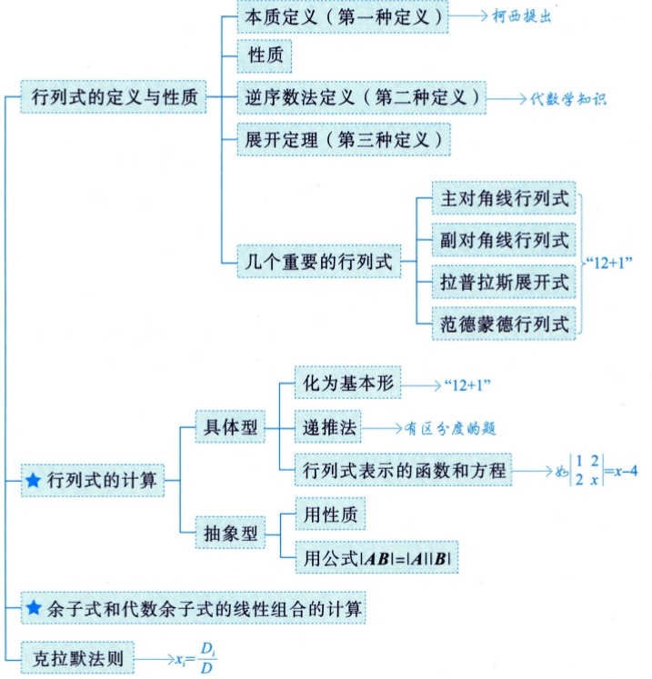

# 第1讲 行列式

> [!abstract] 一句话总结
> 行列式的本质是**测度**（n维体积）：2阶 = 平行四边形**有向面积**。掌握三大定义（本质 / 逆序数 / 展开）、**七大性质**（三种行变换）、三类计算（具体型 →"12+1"型、n阶规律型 → 公式/递推、抽象型 → 性质 + $|AB|=|A||B|$）。



## 核心考点

### 考点1：本质定义 —— 行列式是测度

- **本质属性是测度（体积，面积是特殊体积）**：$\left|\begin{matrix}a_{11}&a_{12}\\a_{21}&a_{22}\end{matrix}\right|=a_{11}a_{22}-a_{12}a_{21}$ = 以两个行向量为邻边的平行四边形的**有向面积**
- 负值：向量逆时针为正、顺时针为负（代数里面积可正可负）
- 三阶 = 平行六面体有向体积；$n$ 阶 = n 维体积
- 意义：整个线代的核心直觉——**矩阵 = 变换，行列式 = 变换前后测度之比**

> [!tip] 三大定义的关系
> 本质定义（几何，直观）→ 逆序数定义（代数，可算 n 阶）→ 展开定理（递推，降阶）。三者统一，考试主要用后两者。

### 考点2：七大性质（行/列地位等价，$|A|=|A^T|$）

| # | 性质 | 一句话记忆 | 考试用途 |
|---|------|-----------|---------|
| 1 | 行列互换值不变 $|A|=|A^T|$ | 行列地位等价 | 行性质可直接用列 |
| 2 | 某行(列)全为 0 → 行列式 = 0 | 降一维测不出 | — |
| 3 | 某行(列)公因子 $k$ 可提出 | **逆用：$k$ 只能乘到一行** | 化简 |
| 4 | 某行(列)是两项和 → 可拆成两个行列式之和 | **单行(列)可拆/加** | 抽象型化简化 |
| 5 | 两行(列)互换 → 变号 | 换 $n$ 次 $\Rightarrow (-1)^n$ | 排成标准形 |
| 6 | 两行(列)相等或成比例 → 0 | 共线无面积 | 判断为 0 |
| 7 | 某行(列)的 $k$ 倍加到另一行(列) → 值不变 | **倍加（最常用）** | 化 0 |

- 补充必记：$A,B$ 同阶方阵时 $\underline{|AB|=|A||B|=|BA|}$
- 几何角度理解全部七条：参考 7 条性质都可从"面积/体积"直观得到，无需死记

### 考点3：n 阶行列式的逆序数定义（第二种定义）

$$|A|=\sum_{j_1j_2\cdots j_n}(-1)^{\tau(j_1j_2\cdots j_n)}\,a_{1j_1}a_{2j_2}\cdots a_{nj_n}$$

- 共 **$n!$ 项**；每项是取自**不同行不同列**的 $n$ 个元素之积（行下标顺排，列下标为任一排列）
- 符号：列下标排列为偶排列取正，奇排列取负（$\tau$ = 逆序数）
- 逆序数计算：逐个元素数后面有几个比它小的，求和
- 常考：判断某个具体项（如 $a_{12}a_{25}a_{31}a_{43}a_{54}$）的正负号 → 行下标顺排后算 $\tau$

> [!warning] 1 阶行列式
> $|a|=a$ 是**数字，可正可负**，不要当成绝对值符号。

### 考点4：展开定理（第三种定义）—— 降阶

- 余子式 $M_{ij}$：去掉 $a_{ij}$ 所在行、列后剩下的 $n-1$ 阶行列式
- 代数余子式：$A_{ij}=(-1)^{i+j}M_{ij}$
- 展开公式：$|A|=a_{i1}A_{i1}+a_{i2}A_{i2}+\cdots+a_{in}A_{in}=\sum_{j=1}^{n}a_{ij}A_{ij}$（按行/按列均可）
- **错位展开 = 0**：$a_{i1}A_{k1}+\cdots+a_{in}A_{kn}=0\quad(i\ne k)$（另一行元素配本行代数余子式）
- ★ 展开原则：**找 0 元素最多的行(列)展开**；展开到"12+1"型就停

### 考点5："12+1"型行列式（必背）

| 类型 | 结果 |
|------|------|
| 主对角线（上/下三角） | $\prod_{i=1}^{n}a_{ii}$ |
| 副对角线 | $(-1)^{\frac{n(n-1)}{2}}a_{1n}a_{2,n-1}\cdots a_{n1}$ |
| 拉普拉斯（分块对角） | $\begin{vmatrix}A&O\\O&B\end{vmatrix}=|A||B|$，$\begin{vmatrix}O&A\\B&O\end{vmatrix}=(-1)^{mn}|A||B|$ |
| 范德蒙德 | $\begin{vmatrix}1&1&\cdots&1\\x_1&x_2&\cdots&x_n\\\vdots&\vdots&&\vdots\\x_1^{n-1}&x_2^{n-1}&\cdots&x_n^{n-1}\end{vmatrix}=\prod_{1\le i<j\le n}(x_j-x_i)$ |

- 识别技巧：范德蒙德**盯第 2 行**，后一项减前一项连乘

### 考点6：具体型行列式的计算套路

1. **爪形**（只有第1行/列 + 对角线非零）：用 $a_{ii}$ 消爪（斜爪消平爪/竖爪）→ 化为基本形
2. **行和相等**（每行元素都是 1 个 a、n-1 个 b）：其余各列加到第 1 列 → 提公因子
$$D_n=[a+(n-1)b](a-b)^{n-1}$$（此结论可**直接背**，含 $a=0,b=1$ 等特例）
3. **X 型**（0 分散在两条斜带）：换列集中成 4 块 → 拉普拉斯
$$D_4=(a_1a_4-b_1b_4)(a_2a_3-b_2b_3)$$，主副对角线元素相同时 $=(a^2-b^2)^n$
4. **宽对角/三对角**（三条线元素）：**递推法** $D_n=f(D_{n-1})$，或数学归纳法（方向相反：递推从上往下，归纳从下往上）
5. 无规律的低阶（3 阶为主）：倍加化 0 → 按 0 最多行展开
6. 元素差别不大的行：**第 1 行的 (-1) 倍加到其余行**

> [!warning] 行和相等的推广（不必背公式，要会"加列提因子"）
> 视 x 为变量的 $\begin{vmatrix}x&b&\cdots&b\\b&x&\cdots&b\\\vdots&&&\vdots\\b&b&\cdots&x\end{vmatrix}=[x+(n-1)b](x-b)^{n-1}$ 是 x 的 n 次多项式，根为 $b$（n-1 重）和 $(1-n)b$——**与第5讲特征值直接挂钩**。

### 考点7：抽象型行列式（元素未知）

- 手段 1：性质化简（单列可拆、互换变号、成比例为 0）
- 手段 2：**$|AB|=|A||B|$**——把列向量的线性组合写成矩阵乘积
$$x_1\boldsymbol\alpha_1+x_2\boldsymbol\alpha_2+x_3\boldsymbol\alpha_3=[\boldsymbol\alpha_1,\boldsymbol\alpha_2,\boldsymbol\alpha_3]\begin{bmatrix}x_1\\x_2\\x_3\end{bmatrix}$$
- 手段 3：反证法（如 $AB=O$ 且 $|B|\ne0 \Rightarrow A=O$，则证 $|B|=0$）

> [!tip] 必背结论
> $AB=O \Rightarrow$ B 的每个列向量都是 $Ax=0$ 的解；$AB=O$ 且 $|B|\ne0 \Rightarrow A=O$。

### 考点8：余子式 / 代数余子式的线性组合

口诀：**大 A 配小 a，逆用展开式；大 A 配小 k，k 把小 a 吃**

- 系数 = 该行元素（$a_{i1}A_{i1}+\cdots$）→ 直接 = $|A|$；系数 = 另一行元素 → 0
- 系数为任意 $k_1,\dots,k_n$ → 把系数**替换该行元素**，算新行列式
- 余子式组合先转代数余子式：$M_{ij}=(-1)^{i+j}A_{ij}$

### 考点9：克拉默法则

- 使用条件：**n 个方程 n 个未知数**（方阵）且 $D=|A|\ne0$ → 唯一解 $x_i=D_i/D$（$D_i$：用常数项替换第 i 列）
- 齐次方程组：$D\ne0$ 只有零解；$D=0$ 有非零解
- 地位：随计算机发展逐渐降低，**识记结论即可**

> [!warning] $D=0$ 时
> 非齐次方程组 $D=0$ → **无解或有无穷多解**（不能说一定无解）；齐次 $D=0$ → 有非零解。

## 易错点

> [!danger] 错题预警（做真题前必看）
> 1. $|A|+|B|\ne|A+B|$；矩阵加法：只有对应**一行(列)不同**的两个行列式才能相加
> 2. 倍乘性质逆用：$k$ 只能乘到**某一行**；乘所有行 → 面积变 $k^n$ 倍
> 3. **X 型行列式不能当 2 阶算**：$D_4=a_1a_2a_3a_4-b_1b_2b_3b_4$ 是错的（共 4 项，副对角线项取正号）
> 4. $k|A|$ 与 $kA$ 的区别：$kA$ 是矩阵每个元素都乘 k，$|kA|=k^n|A|$（结合第2讲）
> 5. $|a|$ 是数字可正可负，不是绝对值
> 6. 两行成比例 → 行列式为 0（性质6），做题时最容易被忽略

## 方法决策树

```
遇到行列式
├─ 有规律（可背公式）→ 爪形 / 行和相等 / X型 / 三对角 / 范德蒙德 → 直接套
├─ 无规律
│   ├─ 低阶(≤4) → 倍加化0 → 按0最多行展开 → 化成"12+1"型
│   └─ 含字母/高阶 → 找元素分布规律 → 递推法 或 加列提因子
└─ 抽象型（元素未知）
    ├─ 列向量线性组合 → 凑成矩阵乘积 → |AB|=|A||B|
    └─ 其它 → 性质拆/换/提 + 与已知行列式对照
```

## 闪卡（Spaced Repetition）

- 2阶行列式的几何意义::以两个行向量为邻边的平行四边形的有向面积（本质是测度）
- $|AB|$ = ?（A、B 为同阶方阵）:: $|A||B|$
- 副对角线行列式的值:: $(-1)^{\frac{n(n-1)}{2}}$ × 副对角线元素之积
- $\begin{vmatrix}O&A\\B&O\end{vmatrix}$（A: m阶，B: n阶）:: $(-1)^{mn}|A||B|$
- 范德蒙德行列式的值:: $\prod_{1\le i<j\le n}(x_j-x_i)$
- 错位展开定理::某行元素 × 另一行对应代数余子式之和 = 0
- 行和相等行列式 $D_n$:: $[a+(n-1)b](a-b)^{n-1}$（其余列加到第1列后提公因子）
- 克拉默法则的适用条件:: n 个方程 n 个未知数，系数行列式 $D\ne0$，解 $x_i=D_i/D$
- 齐次方程组 $Ax=0$ 有非零解的条件:: 系数行列式 $D=0$
- 逆序数定义：行列式共几项、每项怎么取:: $n!$ 项，每项为不同行不同列元素之积，符号 $(-1)^{\tau}$（列下标排列的逆序数）

## 复习清单

- [ ] 默写 7 大性质（含"行/列等价"、三种变换的名称：互换、倍乘、倍加）
- [ ] 重做 例1.2（爪形）、例1.4（行和相等）、例1.5（X型）、例1.7（递推）、例1.12（余子式组合）
- [ ] 重做 例1.10、例1.11（抽象型：拆、换、凑乘积）
- [ ] 1000题 对应章节：行列式计算 3 道 + 抽象型 2 道

## 关联

- 原文：[[第1讲-行列式]]（拆分稿）
- 后续：[[第2讲-矩阵]]——$|AB|=|A||B|$ 的运算基础、$kA$ 与 $|kA|=k^n|A|$
- 后续：第5讲 特征值与特征向量——含 $\lambda$ 的行列式 = 特征多项式，行列式 = 特征值之积
